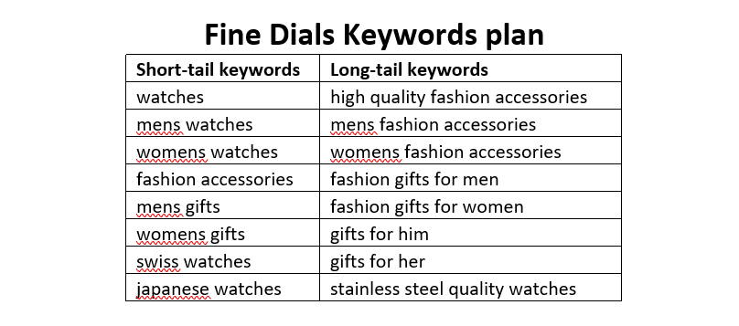
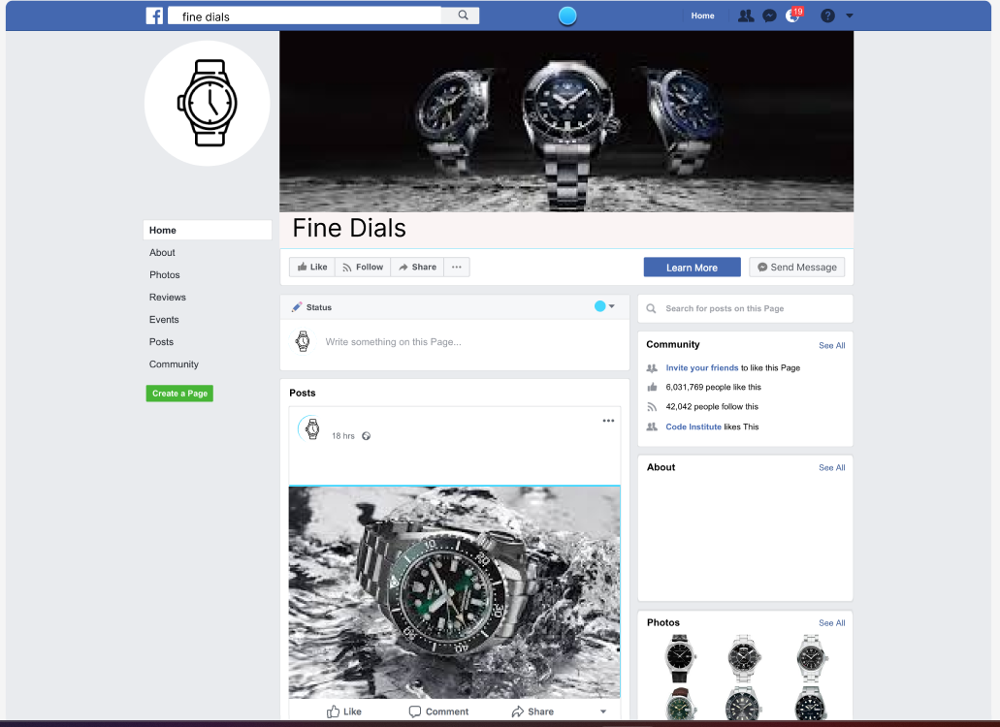
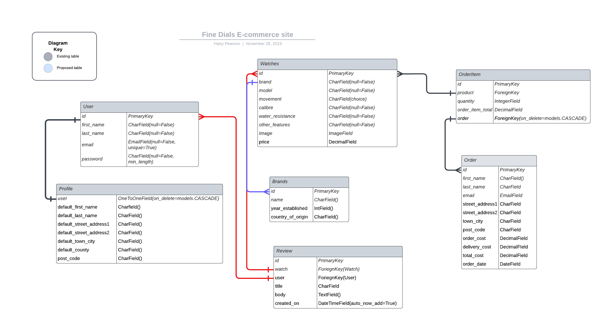

# Fine Dials
Fine Dials is a fictional e-commerce site for a business that sells watches.

# Business Model
<details>

<summary>Who is the customer?</summary>

Customers of Fine Dials are those that are looking to purchase a watch for them selves or a gift for a friend or loved one to mark a special occasion or to simply treat themselves. Watches sold by fine dials include those from the affordable end of the spectrum, all the way to the luxury end so there will be a number of pieces to suit many customers’ requirements and tastes. This customer type is known as Business to Customer (B2C) as we are selling to individuals and not businesses. These types of customers tend to be more prone to impulse buying and therefore advertisement plays a crucial part in enticing them to decide on making a purchase.
</details>
<details>
<summary>What is being sold?</summary>

Fine Dials specialise in selling watches so therefore are a business dealing in products. In the database it is important that we have product details such as the product name, description and price. Other areas to think about would be stock quantities, shipping or delivery cost, shipping address, ratings, reviews and product images.
Features of a site that sells products would be likely to include searching, sorting and filtering, notices when items are sold out and notifications.
</details>
<details>

<summary>How is payment being made?</summary>

The payment would be made in one single payment. This type of payment is suitable to those that sell products with no subscription option. Customers can select their items that they want to buy, add them to their basket and them pay for them in one transaction.
</details>

# Search Engie Optimisation (SEO)
<details>
<summary>Why is it important?</summary>

Having good SEO is important because it helps you rank higher in a search engines score which means your site will be found by more people on the internet, therefore, more potential customers will find your site and hopefully make purchases.
</details>
<details>
<summary>How Google’s search engine works</summary>

Google Search is a major piece of software that takes the keywords we put into it and searches the world wide web for sites related to them. It then brings these sites to the user in an order it thinks will be most useful to them. This order is referred to as ranking.

Many factors go into the ranking system, including where the user lives, how up-to-date the page is, how other pages link to that page, frequency that the searched-for words appear on the page, if the keyword is in the page title, if the keyword has been bolded or if there are pictures with the keyword in the alt or title attribute just to name a few.

The algorithm that Google uses to rank these pages is kept hidden to help safeguard against low quality spam websites that have been artificially boosted to rank higher in the search results. Google also uses Google Raters; humans employed by Google to teach their software which sites are of high quality and which are spam websites.
</details>

<details>
<summary>Short-tail and Long-tail keywords</summary>

Short-tail keyword, sometimes referred to as head terms, are one or two words long. The attract a wider selection of users, many of them not being your target audience and they are much more competitive. Long-tail keywords are often in comprised of phrases or sentences with a clear definition, mean less competition.
</details>
<details>
<summary>Keyword Plan</summary>

Below is a small table I used to brain dump and plan some potential short-term and long-term keywords for Fine Dials


</details>

## Home Page Content Plan
### What do my users need
* Easy navigation around the site
* Indication of what we sell
* Information on how to contact us
* News on offers
* What categories of products there are
* Information on watches
### What information and features could I include to meet those needs?
* Navigation bar that is easy to use
* Images that advertise the products we sell
* A list of our contact details in the footer on each page
* Advertisement banners on any offers that a currently available
* Quick links to the most popular categories
* An FAQ section that give users a basic understanding of watches

### How can I make the information easy to understand?
* Through the use of relevant images
* Simple but effective styling so the page does not appear cluttered

### How can I demonstrate expertise, authoritativeness and trustworthiness in my content?
* Use engage content that is link to the product
* Have clear descriptions and details of each product

### Would there be other pages within my site that I could link my site to from the home page?
* I could link to the FAQs section to give users valuable information

### Are there opportunities to link back to external websites that already rank highly on Google?
* I could link to blog posts about watches and other useful articles.
* List of potential sites:
    * [A Blog to Watch](https://www.ablogtowatch.com/)
    * [Hodinkee](https://www.hodinkee.com/)
    * [Teddy Balassare](https://teddybaldassarre.com/en-gb/blogs/watches)

### How can I help users discover other relevant part of my web application?
* Use links to encourage users to access different parts of my site
* Feature the sections in the navigation bar

# Web Marketing
<details>
<summary>Who are my users?</summary>

The users for my site will vary, watches are desired by those from all age ranges and there are watches affordable to any income level so it is important to have a marketing strategy for the majority rather than the minority.
</details>
<details>
<summary>What platforms would my users be on?</summary>

A good amount of my users would be on social media platforms or content creation platforms such as YouTube in order to find more information on watches. There is a massive following for watch content creators on these kinds of platforms, looking for things such as reviews, updates on releases and guides on watches.
</details>
<details>
<summary>Can I meet my user's needs with useful content?</summary>

I believe that a fair portion of my user’s needs could be met with content creation, as a lot of people who are into watches tend to be enthusiasts who treat watch collecting more as a hobby and therefore get as much enjoyment from researching watches as they do buying them. If my site uses content creation as a place not only as a place to buy watches but also a place where people can learn about watches, then it will bring more potential customers.
</details>
<details>
<summary>What marketing strategies do similar businesses employ?</summary>

Commonly, similar businesses would use social media, content and influencer marketing as social media and content marketing help the brand build reputation and a relationship with their target customers and influencer marketing can help with impulse purchases as potential customers will see someone they idolise with a product and they will feel the need to buy this same product.
</details>
<details>
<summary>Marketing types suitable to my Website</summary>

* Content Marketing
    * Effective content can evoke an emotional response, building trust and loyalty
    * Content can be tuned to suit particular clients and customers
    * Enables businesses to display their expertise and therefore will aid them to be perceived as trustworthy by users
    * Improved chances of having content shared by clients
    * Must work closely with other types of marketing, particularly SEO and Social Media Marketing
    * Must be organised and consistent
    * Content creation requires investment of resources and time
* Organic social media marketing
    * It is free to use
    * A great way to build a relationship with potential customers
    * It requires regular updates in order to remain visible
    * However, paid social media marketing may force itself onto potential customer but it can be a financial waste if it is unsuccessful
</details>

## Facebook Business Page Mockup

Below is a mockup I create for a business page for Fine Dials using [Figma](https://www.figma.com/).


## Agile Methodology
The plan for this project was carried out using Agile Methodology. GitHub Issues were used to record the User Stories. These were made up of all the key functionality that a user would expect from a Restaurant website.

Each Each User Story contains Acceptance Criteria and Tasks which I sometimes had to adjust during the process, as I wasn't yet sure what was required to achieve the Acceptance Criteria.

To aid with prioritisation, I used The MoSCoW Method, which consisted of classifying each User Story as a 'Must Have', 'Should Have' or 'Could Have'. Some 'Could Have's didn't make it into the project and were left in the Backlog for a future iteration. It is important to note here, that by writing only enough User Stories to reach the Minimum Viable Product(MVP), 'Won't Have' was not included currently as a category.

To summarise, I found using the Agile Methodology of great benefit as it helped me to better organise, prioritise and plan the development of my project. Although I didn't give myself a specific duration for each iteration, it greatly helped my time management. I also felt sense of achievement, ticking off the Tasks while working on a User Story and placing it in the 'Done' column when it was completed.

## User Experience

### Strategy / Site Objectives
Fine Dials aims to be a place where people can purchase watches reliably and find links to relevant articles so they can find out more information on watches.

Users can securely checkout their purchases and signup to view their order history and create a profile.

The target audience is aimed and people of all ages

### Scope / User Stories

User stories can be found on [here](https://github.com/users/hpearson98/projects/3) in the projects or issues section on the Github repository.

### Structure / Designs Choices

The website is simple to use and consistent within its structure. The website was designed to be responsive on screens from 375px and above, making it great ti use from mobile to desktop.

For desktop users the navigation bar shows the 'Fine Dials' logo and links to pages for different watch categories, 'profile' and 'logout' (for authenticated users) or 'Sign up' and 'Login' pages (for unauthenticated users). Super users also have an extra link: 'Product Management' which allows them to add, edit and delete products from the database. For users on a screen size of 990px or below the navigation bar will collapse down and be accessible via a burger button to save screen space and a more polished appearance. The navigation bar is repeated across all pages on the site, allowing for easy navigation.

The Footer displays social media links which open in a separate tab for ease of use. It also displays the newsletter signup form which allows users to sign up to be added to a mailing list for more content. The footer is also repeated across all pages to keep the design uniform and for ease of access.

The Home Page clearly indicates the purpose of the site with a jumbotron which will urge users to start browsing the collection of watches available

The watches page allows the user to browse the watches available. Watches can be sorted by price, rating, or name.

The Watch Details page allows users to view the details of the selected watch and allows them to add it to their basket.

The basket page allows users to view their current basket, adjust the quantity of their items and move on to securely checkout their items.

The checkout page allows users to input their delivery and payment information so they can confirm their payment.Once payment is made, users are then emailed a confirmation of their order.

The Sign up / Login pages are clear and and display the fields in a familiar format to the user.

#### Database Schema

One custom model has been implemented for this project: Reservation.



## Deployment

Although I did not for this particular project, for good practice, you should deploy early to Heroku in order to save time and avoid inconveniences later on.

After installing Django and the supporting libraries, the basic Django project was created and migrated to the database.

The database provided by Django db.sqlite3 is only accessible within the workspace environment. In order for Heroku to be able to access the database, a new database suitable for production needs to be created. I am using a postgreSQL database instance hosted on ElephantSQL as this service is free.

<details>
<summary>Steps taken before deploying the project to Heroku</summary>

### Create the Heroku App

1. Login to Heroku and click on the top right button ‘New’ on the dashboard. 
2. Click ‘Create new app’.
3. Give your app a unique name and select the region closest to you. 
4. Click on the ‘Create app’ button.

### Create the PostgreSQL Database

1. Login to ElephantSQL and click on the top right button ‘Create New Instance’.
2. Give your plan the name of the project and select the Tiny Turtle (Free) plan.  The ‘Tags’ field can be left empty.  
3. Click on ‘Select Region’ and select a data centre near you and click ‘Review’.  
4. Make sure your plan is correct and click ‘Create Instance’. 
5. Return to the dashboard and click on this project’s instance you just created. This will open up the “Details” page where the link to the URL is displayed.  This needs to be added to the env.py file in the project’s directories.

### Create the env.py file

With the database created, it now needs to be connected with the project.  Certain variables need to be kept private and should not be published to GitHub.  

1. In order to keep these variables hidden, it is important to create an env.py file and add it to .gitignore.  
2. At the top **import os** and set the DATABASE_URL variable using the `os.environ` method. Add the URL copied from instance created above to it, like so:
`os.environ[“DATABASE_URL”] = ”copiedURL”`
3. The Django application requires a SECRET_KEY to encrypt session cookies.  Set this variable to any string you like or generate a secret key on this [MiniWebTool](https://miniwebtool.com/django-secret-key-generator/).
`os.environ[“SECRET_KEY”] = ”longSecretString”`

### Modify settings.py 

It is important to make the Django project aware of the env.py file and to connect the workspace to the new database. 

1. Open up the settings.py file and add the following code. The if statement acts as a safety net for the application in case it is run without the env.py file.
```
import os
import dj_database_url

if os.path.isfile(‘env.py’):
    import env
```
2. Remove the insecure secret key provided by Django and reference the variable set in the env.py file earlier, like so:
```
SECRET_KEY = os.environ.get(‘SECRET_KEY’)
```
3. You can leave DEBUG as True or set it to `'DEVELOPMENT' in os.environ` and then add the following to the env.py file:
```
os.environ["DEVELOPMENT"] = "True"
```
4. Hook up the database using the dj_database_url import added above.
```
DATABASES = {
    'default': dj_database_url.parse(os.environ.get('DATABASE_URL'))
}
```
5. Save and migrate this database structure to the newly connected postgreSQL database.  Run the migrate command in your terminal
`python3 manage.py migrate`

6. To make sure the application is now connected to the remote database hosted on ElephantSQL, head over to your ElephantSQL dashboard and select the newly created database instance. Select the ‘Browser’ tab on the left and click on ‘Table queries’.  This displays a dropdown field with the database structure which has been populated from the Django migrations.
### Connect the Database to Heroku

1. Open up the Heroku dashboard, select the project’s app and click on the ‘Settings’ tab.
2. Click on ‘Reveal Config Vars’ and add the DATABASE_URL with the value of the copied URL from the database instance created on ElephantSQL.
3. Also add the SECRET_KEY with the value of the secret key added to the env.py file. 
4. If using gitpod another key needs to be added in order for the deployment to succeed.  This is PORT with the value of 8000.

### Amazon Web Services Setup

### Setup the Templates Directory

In settings.py, add the following under BASE_DIR 
`TEMPLATES_DIR = os.path.join(BASE_DIR, "templates")`
then scroll down to the TEMPLATES variable and add the following to the value of DIRS:
```
'DIRS': [TEMPLATES_DIR],
```

### Add the Heroku Host Name

In settings.py scroll to ALLOWED_HOSTS and add the Heroku host name.  This should be the Heroku app name created earlier followed by `.herokuapp.com`.  Add in `’localhost’` so that it can be run locally.
```
ALLOWED_HOSTS = [‘heroku-app-name.herokuapp.com’, ‘localhost’]
```
### Create the Directories and the Process File

1. Create the media, static and templates directories at the top level next to the manage.py file. 
2. At the same level create a new file called ‘Procfile’ with a capital ‘P’.  This tells Heroku how to run this project.  
3. Add the following code, including the name of your project directory. 
```
web: gunicorn fine_dials.wsgi
```
* ‘web’ tells Heroku that this a process that should accept HTTP traffic.
* ‘gunicorn’ is the server used.
* ‘wsgi’, stands for web services gateway interface and is a standard that allows Python services to integrate with web servers.
4. Save everything and push to GitHub.
</details>

<details>
<summary>First Deployment</summary>

### First Deployment

1. Go back to the Heroku dashboard and click on the ‘Deploy’ tab.  
2. For deployment method, select ‘GitHub’ and search for the project’s repository from the list. 
3. Select and then click on ‘Deploy Branch’.  
4. When the build log is complete it should say that the app has been successfully deployed.
5. Click on the ‘Open App’ button to view it and the Django “The install worked successfully!” page, should be displayed. 

</details>

### Final Deployment

1. When development is complete, if you had left `DEBUG = True` in the settings.py file, make sure to change it to `False`. You don't have to change anything if you had used `DEBUG = 'DEVELOPMENT' in os.environ` as your env.py file is ignored by GitHub. 
2. Commit and push your code to your project's repository.
3. Then open up Heroku, navigate to your project's app. Click on the 'settings' tab, open up the config vars and delete the DISABLE_COLLECTSTATIC variable. 
4. Navigate to the 'Deploy' tab and scroll down to 'Deploy a GitHub branch'.
5. Select the branch you want to deploy and click on the 'Deploy branch' button. When the app is deployed, you should see a message in the built log saying "Your app was successfully deployed".  Click 'View' to see the deployed app in the browser. Alternatively, you can click on the 'Open App' button at the top of the page. 

</details>

### Forking the Github repository

Forking allows you to view and edit the code without affecting the original repository

1. Locate the GitHub repository. Link to this repository can be found [here](https://github.com/hpearson98/fine-dials).
2. Click on 'Fork', in the top right-hand corner.
3. This will take you to your own repository to a fork with the same name as the original branch.

### Creating a local clone

1. Go to the GitHub repository. Link to this repository can be found [here](https://github.com/hpearson98/fine-dials).
2. Click on 'Code' to the right of the screen. This will open a dropdown. Click on HTTPs and copy the link.
3. Open Git Bash in your IDE and change the current working directory to the location where you want the cloned directory.
4. Type `git clone`, paste the URL you copied earlier, and press Enter to create your local clone.

# Accreditations

## Code

The walkthrough project listed below were used purely for inspiration. I used their ideas and methods and simply put them into the context of my own project.

However, this project was the first time I create an e-commerce so I felt as though I had to rely on the walkthrough project. It was also the first time using services such as [Stripe](https://stripe.com/gb) and [AWS](https://aws.amazon.com/)
* Code Institute - Boutique Ado

Documentation I often refered to:
* [Django documentation](https://docs.djangoproject.com/en/3.2/)
* [Bootstrap documentation](https://getbootstrap.com/docs/5.0/getting-started/introduction/)
* [Django-Allauth documentation](https://django-allauth.readthedocs.io/en/latest/)

Other sources I found useful:
* 
* 
* 
* 

# Media

## Picture sources

[Seiko Presage SRPB41](https://www.google.com/imgres?imgurl=https%3A%2F%2Fwww.seikowatches.com%2Fuk-en%2F-%2Fmedia%2FImages%2FProduct--Image%2FAll%2FSeiko%2F2022%2F02%2F20%2F01%2F55%2FSRPB41J1%2FSRPB41J1.png&tbnid=884EemFVsfUmFM&vet=12ahUKEwi5-LvRooCCAxWOpycCHR7NDpAQMygAegUIARDaAQ..i&imgrefurl=https%3A%2F%2Fwww.seikowatches.com%2Fuk-en%2Fproducts%2Fpresage%2Fsrpb41j1&docid=k-eEakmqQxAcNM&w=1102&h=1102&q=seiko%20srpb41&ved=2ahUKEwi5-LvRooCCAxWOpycCHR7NDpAQMygAegUIARDaAQ)

[Seiko Speedtimer SCC813](https://www.google.com/imgres?imgurl=https%3A%2F%2Fwww.seikowatches.com%2Fuk-en%2F-%2Fmedia%2FImages%2FProduct--Image%2FAll%2FSeiko%2F2022%2F02%2F20%2F04%2F36%2FSSC813P1%2FSSC813P1.png&tbnid=3FFEGC96P0qJeM&vet=12ahUKEwjQzv3Do4CCAxWqUaQEHTE4BDUQMygAegUIARCZAQ..i&imgrefurl=https%3A%2F%2Fwww.seikowatches.com%2Fuk-en%2Fproducts%2Fprospex%2Fssc813&docid=-sCuAoJ-waQWGM&w=1102&h=1102&q=seiko%20scc813&ved=2ahUKEwjQzv3Do4CCAxWqUaQEHTE4BDUQMygAegUIARCZAQ)

[Seiko 5 Sports SRPK29](https://www.google.com/imgres?imgurl=https%3A%2F%2Fwww.seikowatches.com%2Fuk-en%2F-%2Fmedia%2FImages%2FProduct--Image%2FAll%2FSeiko%2F2023%2F03%2F30%2F11%2F57%2FSRPK29K1%2FSRPK29K1.png%3Fmh%3D1000%26mw%3D1000%26hash%3DE4EFE839BFD041AD230FCF3CE2D82DAE&tbnid=29i9Fwq6gensnM&vet=12ahUKEwjs49udpIWCAxXtkScCHT5IBfUQMygAegUIARDsAQ..i&imgrefurl=https%3A%2F%2Fwww.seikowatches.com%2Fuk-en%2Fproducts%2F5sports%2Fsrpk29&docid=XaeO0D6Tp6lLTM&w=1000&h=1000&q=seiko%20srpk29&ved=2ahUKEwjs49udpIWCAxXtkScCHT5IBfUQMygAegUIARDsAQ)

[Seiko Alpinist SPB121](https://www.google.com/imgres?imgurl=https%3A%2F%2Fcontent.thewosgroup.com%2Fproductimage%2F18280010%2F18280010_1.jpg%3Fimpolicy%3Dzoom&tbnid=voLC5DPeYVwv5M&vet=12ahUKEwj-ut75poWCAxXfmScCHfESCSUQ94IIKAB6BQgBEPkB..i&imgrefurl=https%3A%2F%2Fwww.goldsmiths.co.uk%2FSeiko-Prospex-Alpinist-Mens-Watch-SPB121J1%2Fp%2F18280010&docid=zZGB5a5ioRVCAM&w=1600&h=1600&q=seiko%20alpinist&ved=2ahUKEwj-ut75poWCAxXfmScCHfESCSUQ94IIKAB6BQgBEPkB)

[Seiko Prospex Diver SPB143](https://www.google.com/imgres?imgurl=https%3A%2F%2Fwww.seikowatches.com%2Fuk-en%2F-%2Fmedia%2FImages%2FProduct--Image%2FAll%2FSeiko%2F2022%2F02%2F20%2F00%2F49%2FSPB143J1%2FSPB143J1.png&tbnid=LkW0BB01sn40CM&vet=12ahUKEwiAj-SZqYWCAxX_gycCHS1QCTkQMygAegUIARDsAQ..i&imgrefurl=https%3A%2F%2Fwww.seikowatches.com%2Fuk-en%2Fproducts%2Fprospex%2Fspb143j1&docid=_YsabpGrHQRqSM&w=1102&h=1102&q=seiko%20spb143&ved=2ahUKEwiAj-SZqYWCAxX_gycCHS1QCTkQMygAegUIARDsAQ)

[Hamilton Khaki Field Auto](https://www.google.com/imgres?imgurl=https%3A%2F%2Fwww.hamiltonwatch.com%2Fmedia%2Fcatalog%2Fproduct%2Fh%2F7%2Fh70455133_1.png&tbnid=HO_OherxQRx4hM&vet=12ahUKEwiQroiyq4WCAxU3mScCHdBEAjMQMygAegUIARCpAg..i&imgrefurl=https%3A%2F%2Fwww.hamiltonwatch.com%2Fen-gb%2Fh70455133-khaki-field-auto.html&docid=3t_jDvcq1YcefM&w=1200&h=1200&q=hamilton%20khaki%20field%20automatic%2038mm&ved=2ahUKEwiQroiyq4WCAxU3mScCHdBEAjMQMygAegUIARCpAg)

[Hamilton Khaki Aviation Day Date Auto](https://www.google.com/imgres?imgurl=https%3A%2F%2Fwww.hamiltonwatch.com%2Fmedia%2Fcatalog%2Fproduct%2Fh%2F6%2Fh64615135.png&tbnid=QM8acK7D2d8soM&vet=12ahUKEwiP4YWLs4WCAxUnpicCHfRiDDgQMygAegUIARCDAg..i&imgrefurl=https%3A%2F%2Fwww.hamiltonwatch.com%2Fen-gb%2Fh64615135-khaki-aviation-pilot-day-date-auto.html&docid=XikjdsYVymNwKM&w=2000&h=2000&q=hamilton%20khaki%20aviation%20day%20date&ved=2ahUKEwiP4YWLs4WCAxUnpicCHfRiDDgQMygAegUIARCDAg)

[Hamilton Jazzmaster Gent Auto](https://www.google.com/imgres?imgurl=https%3A%2F%2Fwatchesofmayfair.com%2Fmedia%2Fcatalog%2Fproduct%2Fcache%2F789a43c4e9a5a1e754ee1289235666c4%2Fh%2Fa%2Fhamilton-jazzmaster-gent-quartz-h32451731_image-01.png&tbnid=YNGZ7SUlN2DqeM&vet=12ahUKEwiXu-XN9omCAxXJpicCHamRBToQMygQegUIARDTAg..i&imgrefurl=https%3A%2F%2Fwatchesofmayfair.com%2Fbrand%2Fhamilton%2Fjazzmaster-collection%2Fhamilton-jazzmaster-gent-quartz-h32451731&docid=c76a_PoPuP6qsM&w=1000&h=1000&q=hamilton%20jazzmaster%20quartz&ved=2ahUKEwiXu-XN9omCAxXJpicCHamRBToQMygQegUIARDTAg)

[Tissot PR100](https://www.google.com/imgres?imgurl=http%3A%2F%2Fwww.berrysjewellers.co.uk%2Fcdn%2Fshop%2Ffiles%2FGreen-PR-100.png%3Fv%3D1698245864%26width%3D2048&tbnid=WSzHsXa86ZcAtM&vet=12ahUKEwjgnrfczeGCAxXJV6QEHdy7DdEQ94IIKAN6BQgBEPYB..i&imgrefurl=https%3A%2F%2Fwww.berrysjewellers.co.uk%2Fproducts%2Fpr-100-steel-40mm-mens-quartz-bracelet-watch-1&docid=Z70aUoeowOQ7oM&w=1000&h=1000&itg=1&q=tissot%20pr100%20quartz&ved=2ahUKEwjgnrfczeGCAxXJV6QEHdy7DdEQ94IIKAN6BQgBEPYB)

## Acknowledgements
* I would like to that my Mentor, Jack for their quality and continuous feedback.
* I would like to thank Tutor Support for their amazing assistance.