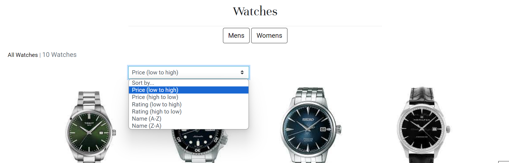
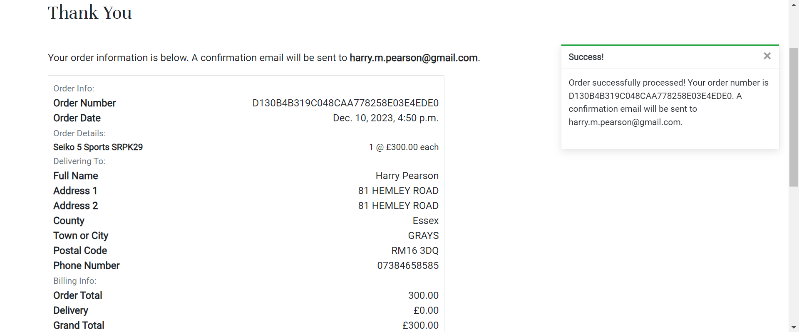
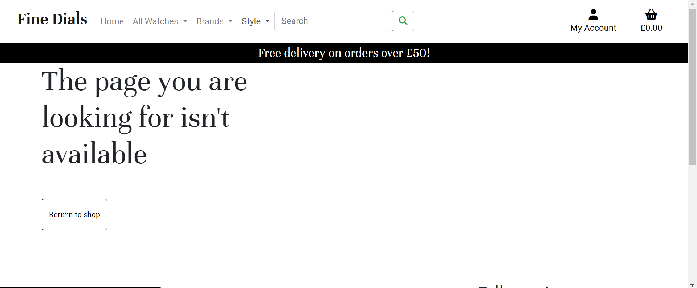

# Fine Dials
Fine Dials is a fictional e-commerce site for a business that sells watches.

# Business Model
<details>

<summary>Who is the customer?</summary>

Customers of Fine Dials are those that are looking to purchase a watch for them selves or a gift for a friend or loved one to mark a special occasion or to simply treat themselves. Watches sold by fine dials include those from the affordable end of the spectrum, all the way to the luxury end so there will be a number of pieces to suit many customers’ requirements and tastes. This customer type is known as Business to Customer (B2C) as we are selling to individuals and not businesses. These types of customers tend to be more prone to impulse buying and therefore advertisement plays a crucial part in enticing them to decide on making a purchase.
</details>
<details>
<summary>What is being sold?</summary>

Fine Dials specialise in selling watches so therefore are a business dealing in products. In the database it is important that we have product details such as the product name, description and price. Other areas to think about would be stock quantities, shipping or delivery cost, shipping address, ratings, reviews and product images.
Features of a site that sells products would be likely to include searching, sorting and filtering, notices when items are sold out and notifications.
</details>
<details>

<summary>How is payment being made?</summary>

The payment would be made in one single payment. This type of payment is suitable to those that sell products with no subscription option. Customers can select their items that they want to buy, add them to their basket and them pay for them in one transaction.
</details>

# Search Engie Optimisation (SEO)
<details>
<summary>Why is it important?</summary>

Having good SEO is important because it helps you rank higher in a search engines score which means your site will be found by more people on the internet, therefore, more potential customers will find your site and hopefully make purchases.
</details>
<details>
<summary>How Google’s search engine works</summary>

Google Search is a major piece of software that takes the keywords we put into it and searches the world wide web for sites related to them. It then brings these sites to the user in an order it thinks will be most useful to them. This order is referred to as ranking.

Many factors go into the ranking system, including where the user lives, how up-to-date the page is, how other pages link to that page, frequency that the searched-for words appear on the page, if the keyword is in the page title, if the keyword has been bolded or if there are pictures with the keyword in the alt or title attribute just to name a few.

The algorithm that Google uses to rank these pages is kept hidden to help safeguard against low quality spam websites that have been artificially boosted to rank higher in the search results. Google also uses Google Raters; humans employed by Google to teach their software which sites are of high quality and which are spam websites.
</details>

<details>
<summary>Short-tail and Long-tail keywords</summary>

Short-tail keyword, sometimes referred to as head terms, are one or two words long. The attract a wider selection of users, many of them not being your target audience and they are much more competitive. Long-tail keywords are often in comprised of phrases or sentences with a clear definition, mean less competition.
</details>
<details>
<summary>Keyword Plan</summary>

Below is a small table I used to brain dump and plan some potential short-term and long-term keywords for Fine Dials


</details>

## Home Page Content Plan
### What do my users need
* Easy navigation around the site
* Indication of what we sell
* Information on how to contact us
* News on offers
* What categories of products there are
* Information on watches
### What information and features could I include to meet those needs?
* Navigation bar that is easy to use
* Images that advertise the products we sell
* A list of our contact details in the footer on each page
* Advertisement banners on any offers that a currently available
* Quick links to the most popular categories
* An FAQ section that give users a basic understanding of watches

### How can I make the information easy to understand?
* Through the use of relevant images
* Simple but effective styling so the page does not appear cluttered

### How can I demonstrate expertise, authoritativeness and trustworthiness in my content?
* Use engage content that is link to the product
* Have clear descriptions and details of each product

### Would there be other pages within my site that I could link my site to from the home page?
* I could link to the FAQs section to give users valuable information

### Are there opportunities to link back to external websites that already rank highly on Google?
* I could link to blog posts about watches and other useful articles.
* List of potential sites:
    * [A Blog to Watch](https://www.ablogtowatch.com/)
    * [Hodinkee](https://www.hodinkee.com/)
    * [Teddy Balassare](https://teddybaldassarre.com/en-gb/blogs/watches)

### How can I help users discover other relevant part of my web application?
* Use links to encourage users to access different parts of my site
* Feature the sections in the navigation bar

# Web Marketing
<details>
<summary>Who are my users?</summary>

The users for my site will vary, watches are desired by those from all age ranges and there are watches affordable to any income level so it is important to have a marketing strategy for the majority rather than the minority.
</details>
<details>
<summary>What platforms would my users be on?</summary>

A good amount of my users would be on social media platforms or content creation platforms such as YouTube in order to find more information on watches. There is a massive following for watch content creators on these kinds of platforms, looking for things such as reviews, updates on releases and guides on watches.
</details>
<details>
<summary>Can I meet my user's needs with useful content?</summary>

I believe that a fair portion of my user’s needs could be met with content creation, as a lot of people who are into watches tend to be enthusiasts who treat watch collecting more as a hobby and therefore get as much enjoyment from researching watches as they do buying them. If my site uses content creation as a place not only as a place to buy watches but also a place where people can learn about watches, then it will bring more potential customers.
</details>
<details>
<summary>What marketing strategies do similar businesses employ?</summary>

Commonly, similar businesses would use social media, content and influencer marketing as social media and content marketing help the brand build reputation and a relationship with their target customers and influencer marketing can help with impulse purchases as potential customers will see someone they idolise with a product and they will feel the need to buy this same product.
</details>
<details>
<summary>Marketing types suitable to my Website</summary>

* Content Marketing
    * Effective content can evoke an emotional response, building trust and loyalty
    * Content can be tuned to suit particular clients and customers
    * Enables businesses to display their expertise and therefore will aid them to be perceived as trustworthy by users
    * Improved chances of having content shared by clients
    * Must work closely with other types of marketing, particularly SEO and Social Media Marketing
    * Must be organised and consistent
    * Content creation requires investment of resources and time
* Organic social media marketing
    * It is free to use
    * A great way to build a relationship with potential customers
    * It requires regular updates in order to remain visible
    * However, paid social media marketing may force itself onto potential customer but it can be a financial waste if it is unsuccessful
</details>

## Facebook Business Page Mockup

Below is a mockup I create for a business page for Fine Dials using [Figma](https://www.figma.com/).


## Agile Methodology
The plan for this project was carried out using Agile Methodology. GitHub Issues were used to record the User Stories. These were made up of all the key functionality that a user would expect from a Restaurant website.

Each Each User Story contains Acceptance Criteria and Tasks which I sometimes had to adjust during the process, as I wasn't yet sure what was required to achieve the Acceptance Criteria.

To aid with prioritisation, I used The MoSCoW Method, which consisted of classifying each User Story as a 'Must Have', 'Should Have' or 'Could Have'. Some 'Could Have's didn't make it into the project and were left in the Backlog for a future iteration. It is important to note here, that by writing only enough User Stories to reach the Minimum Viable Product(MVP), 'Won't Have' was not included currently as a category.

To summarise, I found using the Agile Methodology of great benefit as it helped me to better organise, prioritise and plan the development of my project. Although I didn't give myself a specific duration for each iteration, it greatly helped my time management. I also felt sense of achievement, ticking off the Tasks while working on a User Story and placing it in the 'Done' column when it was completed.

## User Experience

### Strategy / Site Objectives
Fine Dials aims to be a place where people can purchase watches reliably and find links to relevant articles so they can find out more information on watches.

Users can securely checkout their purchases and signup to view their order history and create a profile.

The target audience is aimed and people of all ages

### Scope / User Stories

User stories can be found on [here](https://github.com/users/hpearson98/projects/3) in the projects or issues section on the Github repository.

### Structure / Designs Choices

The website is simple to use and consistent within its structure. The website was designed to be responsive on screens from 375px and above, making it great ti use from mobile to desktop.

For desktop users the navigation bar shows the 'Fine Dials' logo and links to pages for different watch categories, 'profile' and 'logout' (for authenticated users) or 'Sign up' and 'Login' pages (for unauthenticated users). Super users also have an extra link: 'Product Management' which allows them to add, edit and delete products from the database. For users on a screen size of 990px or below the navigation bar will collapse down and be accessible via a burger button to save screen space and a more polished appearance. The navigation bar is repeated across all pages on the site, allowing for easy navigation.

The Footer displays social media links which open in a separate tab for ease of use. It also displays the newsletter signup form which allows users to sign up to be added to a mailing list for more content. The footer is also repeated across all pages to keep the design uniform and for ease of access.

The Home Page clearly indicates the purpose of the site with a jumbotron which will urge users to start browsing the collection of watches available

The watches page allows the user to browse the watches available. Watches can be sorted by price, rating, or name.

The Watch Details page allows users to view the details of the selected watch and allows them to add it to their basket.

The basket page allows users to view their current basket, adjust the quantity of their items and move on to securely checkout their items.

The checkout page allows users to input their delivery and payment information so they can confirm their payment.Once payment is made, users are then emailed a confirmation of their order.

The Sign up / Login pages are clear and and display the fields in a familiar format to the user.

#### Database Schema

Three custom models have been implemented for this project:
* Watch
* Brand
* Review


### Skeleton / Wireframes

Using wireframes greatly aided the planning process and allowed me to have a clear direction I want the structure of the project to go. I completed wireframes for small, medium and large screen sizes to help map their structure.

[Click here to view the wireframes](readme_images/wireframes.pdf)

> [!NOTE]
> Wireframes are not coming out quite as planned but the primary structure is still visible.

### Surface

#### Colour Scheme

The colour scheme that I used was very monochromatic, with splashes of colour for items of interest such as buttons or links.

The primary background colour is White with black text for easy readablility. The jumbotron used on the home page is a contrast to this colour scheme, which has a black background and white text, to indicate the start and end of a new section.

#### Typography

The two fonts I used for this project were Unna and Roboto. Unna was used for the main headings of the site and Roboto was used for the main body of text. Unna is a serif based font while Roboto is a sans-serif which enabled them to offer a good contrast and compliment eachother well while still being easily readable.

#### Icons

Icons were used to display the social media icons in the footer and in the header as well as in other areas of the site as I found it an easy and intuitive way of displaying the links to the user. Aria-labels are used on the links to help assist screen readers.

# Features
## Existing Features
### Header and Nav Bar
The header and navigation are displayed across all pages and includes a link on the Logo which brings the user to the home page. For medium screen sizes and below a hamburger button appears, which expands to show the navigation list to the Home, all watches, brands, style, search bar, account and basket links. This helps reduce the clutter on the header by keeping the page links neatly stowed away until the user clicks the hamburger button.

All links on desktop, are displayed openly across the header, which help the user to navigate easily from page to page, without having to revert back to the previous page via the back button. 

When a user is authenticated the Register and Login links will be replaced with a Logout and profile link.

Super users will get an additional link: Product Management, which will give them the ability to Create, Review, Update and Delete products.

Below the nav bar is the free delivery banner, which displays the total the user has to spend to receive free delivery.


### Footer
The footer, which is displayed across all pages, includes links to social media pages and a email marketing signup form from Mailchimp that the user can use to add themself to a contact list to receive marketing content.

The social media links utilize the hover CSS pseudo-class which gives a good visual indication to the user that they are hovering over a link.


### Filter by Brand, style or gender
In the nav bar, users can filter watches by their brand, style or gender.


### Sort search results
Users can sort their search results by price - high to low, price - low to high, rating - high to low, rating - low to high, name - A-Z or name - Z-A.

### Home Page Content
The home page features a jumbotron that invites the user to view the watches on offer.

It also feautes links to related articles that can help the user learn more about watches.


### Product Card
The product card displays the product image, brand, model, price, style and rating. The style is a link to display all watches of the same style.


### Watch Overview
The watch overview gives all of the key information  of the watch to the user in a format that is easy to read and understand, helping them to make a decision on their purchase.


### Basket Preview
when a watch is added to the basket, a message appears to the user showing a basket preivew. This give information such as current basket items, order total and how much more they have to spend to reach the free delivery freshhold.


### Review Section
The review section allows users to look at reviews on a watch and allows authenticated users to leave a review on a watch. The form requires the subject and body fields to be filled in.


### Basket
The basket page shows what is currently in the user's basket. From this page the user can adjust the quantity of the items in the basket or remove items from their basket. The user can also see the order cost and delivery cost. Once the user is happy they can use the checkout button to begin making payment.


### Checkout Form
The checkout form allows the user to input contact, delivery and payment details. Required fields are first name, last name, email, phone number, street address1, street address 2, town/city and the card details. The payment system comes courtesy of the Strie API and it requires valid card information in order for the payment to be processed.

If the user is authenticated, it prepopulates the form with the user's profile details, for quick and easy checkout.
 
### Order summary
Once the order is complete the user is taken to the checkout success page where they can see all of the details of the order.


### Profile
On the profile page, the user can update delivery information and look at their order history. They can click a link on an individual order to get a detailed look at that order information. This page is only accessible to authenticated users.


### Product management - Add product
When a super user is authenicated, they can access the add product page where they can fill the form to create and add products from inside the site. This is only accessible to superusers.


### Product management - Product card
When a superuser is authenicated they have extra features from the product cards. The have edit and delete buttons allowing them to update or remove products in the database.


### Product Management - Edit product
A superuser can edit the values of a product. This would be useful when there a changes in price or when the product is rebranded.


### Product management - Delete product
A superuser can delete a product from the database. This would be useful if a product was discontinued or had to be removed for any reason. When the bin icon is clicked on the product card the product is deleted and a confirmation message is displayed.


### Account registration
The signup form is based from django-allauth and it requires an email address and two matching passwords in order to be valid. If the form is valid an email will be sent to the email address provided to verify the account.


### Account login
The login form is based from django-allauth and it requires the user to input a verified email address and the matching password.


### Account logout
The logout screen requires a user to confirm they want to logout using a button and the functionality comes courtesy of allauth.


### Custom 404 handler
If a user tries to find a page that does no exist, they will be greeted by the custom error 404 handler page, where the user can easily navigate back to the site.


## Future Features
### Wishlist

### Dedicated brand pages

# Testing
## Header and Nav Bar
### Logo link
#### Expected Result
When a user clicks the Logo link in the nav bar, they should be taken to the home page.

#### Actual Outcome
When the user clicks the logo link, the user is directed to the home page as expected.

### Home link
#### Expected Result
When a user clicks the home link in the nav bar they should be taken to the home page.

#### Actual Outcome
When the user clicks the home link, the user is directed to the home page as expected.

### All Watches - By Price
#### Expected Result
When the user clicks the all watches - by price link in the nev bar, they should be taken to the watches url and displayed all watch products in the order of price lowest to highest.

#### Actual Outcome
When the the all watches - by price link is clicked, the user is taken to the watches page and displayed all watch products from price lowest to highest.

### All watches - By Rating
#### Expected Result
When the user clicks the all watches - by rating link, they should be taken to the watches page and displayed all watches in order of rating highest to lowest.

#### Actual Outcome
When the user clicks the all watches - by rating link, they are taken to the watches page and sown all watches in the order of rating highest to lowest, as expected.

### All Watches - By Style
#### Expected Result
When the user clicks the all watches - by style link, they should be taken to the watches page and displayed all watches, with watches of the same style grouped together.

#### Actual Outcome
When the user clicks the all watches - by style link, they are taken to the watches page and displayed all watches, with watches of the same style grouped together, as expected.

### All Watches - All Products
#### Expected Result
When the user clicks the all watches - all products link, they should be taken to the watches page and displayed all watches.

#### Actual Outcome
When the use clicks the all watches - all products link, they are taken to the watches page and displayed all watches, as expected.

### Brands Links
#### Expected Result
When the user clicks a link from the brands dropdown, they should be taken to the watches page and displayed all the watches produced by the brand that the user clicks on. For example if the user chooses Tissot then all watches made by Tissot should be displayed to the user.

#### Actual Outcome
When the user clicks a link from the brands dropdown, they are taken to the watches page and displayed all the watches produced by the brand that the user has clicks on. This works for any brand the user clicks on.

### Style Links
#### Expected Result
When the user clicks a link from the styles dropdown, they should be taken to the watches page and displayed all the watches that match the style that the user clicks on. For example if the user chooses Dress then all dress watches should be displayed to the user regardless of brand or any other factor.

#### Actual Outcome
When the user clicks a link from the style dropdown, they are taken to the watches page and displayed all the watches that match the style that the user clicks on. This works for any style the user clicks on.

### Search Bar
#### Expected Result
When a user inputs a query into the search bar, their query should be taken and if any watches brand name, watch model, watch description or the watch style contain the query, then those watches should be displayed to the user.

#### Actual Outcome
When a user inputs a query into the search bar, their query is taken be taken and if any watches brand name, watch description or the watch style contain the query, then those watches are displayed to the user. However the watch model is not taken into account.

#### Issue
When the user inputs a query into the search bar, it is not queried against the watch model to chech if the query is contained in the watch model field of any watch on the database.

#### How the Issue Was Resolved
In the view function that checks for queries made in the search bar, I added the code to check if the watch model contains the query. The code can be found below:
```
Q(
    model__icontains=query
)
```

### Account - Register Link
#### Expected Result
When the user clicks the account - register link, they should be taken to the registration page where there is a sign up form prompting the user to create an account.

#### Actual Outcome
When the user clicks the account - register link, they are taken to the registration page where there is a sign up form prompting them to create an account.

### Unauthenticated User's Nav Bar
#### Expected Result
When the user is unauthenticated the user's account dropdown links should be registration and login so they can access page to create an account or login to an existing one.

#### Actual Outcome
When the user is unauthenticated the user's account dropdown links are registration and login so they can access page to create an account or login to an existing one, as expected.

### Authenticated User's Nav Bar
#### Expected Result
When the user is authenticated the user's account dropdown links should be profile and logout so they can access their profile page or logout of their account.

#### Actual Outcome
When the user is authenticated the user's account dropdown links are profile and logout so they can access their profile page logout of their account, as expected.

### Authenticated Super User's Nav Bar
#### Expected Result
When the super user is authenticated the account dropdown links should be product management, profile and logout so they can manage products on the databaase, access their profile page or logout of their account.

#### Actual Outcome
When the super user is authenticated the account dropdown links are product management, profile and logout so they can manage products on the databaase, access their profile page or logout of their account, as expected.

### Account - Login Link
#### Expected Result
When the user clicks the account - login link, they should be taken to the login page where there is a login form prompting the user to login to their account.

#### Actual Outcome
When the user clicks the account - login link, they are taken to the login page where there is a login form prompting the user to login to their account.

### Basket Link
#### Expected Result
The basket link should show the current basket value to the user. When the user clicks the link they should be taken to the basket page, where they can view their current basket.

#### Actual Outcome
The basket link shows the current basket value to the user. When the user clicks the link they are taken to the basket page, where they can view their current basket.

## Footer

### Mailchimp sign-up form
#### Expected Result
The Mailchimp sign-up form should be validated to only submit if the user inputs a valid email address. The user should be able to optionally input first and last names. The form should successfully add the submitted form details to the Mailchimp mailing list.

#### Actual Outcome
The Mailchimp sign-up form is validated to only sumbit if the user inputs a vaid email address. The user can optionally input first and last names. The form successfully adds the submitted form details to the Mailchimp mailing list. Below is a screenshot of contacts that have successfully added form the sign-up form.


### Social Media Links
#### Expected Result
The social media links should have a hover effect that changes the font to help make them intuitive and they should take the user to the correct site, in a new tab so the user is not removed from the site.

#### Actual Outcome
The social media links have a hover effect that changes the font to help make them intuitive and they take the user to the correct site, in a new tab so the user is not removed from the site.

## Home Page
### Mens and Womens Buttons
#### Expected Result
When the user uses these buttons, they should be taken to the watches page and shown all mens watches in the database or all womens watches in the database, depending on the button they click.

#### Actual Outcome
When the user uses these buttons, they are taken to the watches page and shown all mens watches in the database or all womens watches in the database, depending on the button they click.

### Related Blog Links
#### Expected Result
When the user clicks a link to a blog, they should be taken to the blog they clicked on. The blog should open in a new tab so the user is not taken away from the website.
#### Actual Outcome
When the user clicks a link to a blog, they are taken to the blog they clicked on. The blog opens in a new tab so the user is not taken away from the website.

## Watches Page
### Product Card
#### Expected Result
The product card should display the watch image, brand, model, price, style and rating. The watch style should be a link that takes the user to all watches of the same style. If there is no image, the placeholder image should be displayed.
#### Actual Outcome
The product card displays the watch image, brand, model, price, style and rating. The watch style successful functions as a link that takes the user to all watches of the same style. If there is no image, the placeholder image is displayed.

### Sort functionality
#### Expected Result
Users should be able to sort the products on the page by price - highest to lowest, price - lowest to highest, rating - highest to lowest, rating - lowest to highest, name - A-Z or name - Z-A. It should keep the items on the page that the user requested (for example if the user wanted to look at all dive watches and then sort price - lowest - highest, when the page should not refresh and display all watches).
#### Actual Outcome
Users are able to sort the products on the page by price - highest to lowest, price - lowest to highest, rating - highest to lowest, rating - lowest to highest, name - A-Z or name - Z-A (the sorting by name does not take the brand into account, just the model name). It keeps the items on the page that the user requested (for example if the user wanted to look at all dive watches and then sort price - lowest - highest, when the page does not refresh and display all watches).

### Mens and Womens Buttons
#### Expected Result
When the user uses these buttons, they should be taken to the watches page and shown all mens watches in the database or all womens watches in the database, depending on the button they click.

#### Actual Outcome
When the user uses these buttons, they are taken to the watches page and shown all mens watches in the database or all womens watches in the database, depending on the button they click.

### Displayed Products Counter
#### Expected Result
The displayed products counter should display the amount of watches are being displayed to the user depending on the search query results.
#### Actual Outcome
The displayed products counter displays the amount of watches are being displayed to the user depending on the search query results, as intended.

### Super User Aunthenticated Edit Button
#### Expected Result
When a super user is authenticated, there should be a button displayed on the product card that allows the super user to edit their chosen product. It should take them to the edit watch page. It should only be visible to super users.
#### Actual Outcome
When a super user is authenticated, there is a button displayed on the product card that allows the super user to edit their chosen product. It does take them to the edit watch page. It is only visible to super users.

## Watch Detail Page
### Watch Overview
#### Expected Result
The watch overview should display the watch name, image, description, movement, calibre, water resistance, crystal and all other features, in order to inform the user of all relevant information on the watch. The image, when clicked should display the full image to the user in a diffent tab.
#### Actual Outcome
The watch overview displays the watch name, image, description, movement, calibre, water resistance, crystal and all other features, in order to inform the user of all relevant information on the watch. The image, when clicked, displays the full image to the user in a diffent tab.

### Quantity Controls
#### Expected Result
The quantity should be able to be adjusted via the add or minus buttons or input manually into the input field provided. If the current quantity is 1 or below then the minus buttin should be disabled so the user cannot enter an invalid number. If the user manually inputs a number less than 1 and tries to add it to the basket they should be given an error saying the number must be greater than or equal to 1.
#### Actual Outcome
The quantity is be able to be adjusted via the add or minus buttons or input manually into the input field provided. If the current quantity is 1 or below then the minus buttin is disabled so the user cannot enter an invalid number. If the user manually inputs a number less than 1 and tries to add it to the basket they are given an error saying the number must be greater than or equal to 1.
### Add to Basket Button
#### Expected Result
The add to basket button should add the current watch that the user is viewing and their selected quantity to the basket. They should receive an alert indicating the item or items were added successfully, a preview of their updated basket, showing the items in the basket and the updated price.
#### Actual Outcome
The add to basket button adds the current watch that the user is viewing and their selected quantity to the basket. They receive an alert indicating the item or items were added successfully, a preview of their updated basket, showing the items in the basket and the updated price.

### Keep Shopping Button
#### Expected Result
The keep shopping button should take the user back to the watches page, displaying watches for sale to the user.

#### Actual Outcome
The button works as expected, however the button does not function properly as you need to click the text in order for the link to work. And the text in the button, when hovered, has add text decoration, which is not desired.

#### What Was Done to Resolve the Issue?
To resolve the issue I simply removed the button element and just used an anchor element and used css to style it like a button. This made the whole area of the button clickable and functional.

### Super User Aunthenticated Edit Button
#### Expected Result
When a super user is authenticated, there should be a button displayed on the product card that allows the super user to edit their chosen product. It should take them to the edit watch page. It should only be visible to super users.
#### Actual Outcome
When a super user is authenticated, there is a button displayed on the product card that allows the super user to edit their chosen product. It does take them to the edit watch page. It is only visible to super users.

### Reviews Section - Unauthenticated Users
#### Expected Result
In the reviews section, if the user is unauthenticated, it should show all reviews left for the watch they are looking at. However, it should not allow them to leave a review, instead it should display a message telling them to create an account or login to an existing one.
#### Actual Outcome
In the reviews section, if the user is unauthenticated, it shows all reviews left for the watch they are looking at. It does not allow them to leave a review, instead it displays a message telling them to create an account or login to an existing one. as expected.

### Reviews Section - Authenticated User
#### Expected Result
In the reviews section, if the user is authenticated, it should show all reviews left for the watch they are looking at. It should also allow them to leave a review by displaying the review form. The form should be validated so that both the title and the body fields are required in order to submit the review.
#### Actual Outcome
In the reviews section, if the user is authenticated, it shows all reviews left for the watch they are looking at. It also allows them to leave a review by displaying the review form. The form is be validated so that both the title and the body fields are required in order to submit the review.

## Basket Page
### Product Info
#### Expected Result
If there is no products in the basket, it should display an empty basket message to the user and a keep shopping button that takes the user to the watches page so the user can view items to purchase. If there are items in the basket, it should display the image, name, quantity and price of all items in the items in the basket.
#### Actual Outcome
If there is no products in the basket, it displays an empty basket message to the user and a keep shopping button that takes the user to the watches page so the user can view items to purchase. If there are items in the basket, it displays the image, name, quantity and price of all items in the items in the basket.

### Update Quantity/Remove Buttons
#### Expected Result
The quantity should be able to be adjusted via the add or minus buttons or input manually into the input field provided. If the current quantity is 1 or below then the minus button should be disabled so the user cannot enter an invalid number. If the user manually inputs a number less than 1 and tries to add it to the basket they should be given an error saying the number must be greater than or equal to 1.

If the user clicks the remove button, for an item in their basket, all of that item should be removed, regardless of quantity.
#### Actual Outcome
The quantity is be able to be adjusted via the add or minus buttons or input manually into the input field provided. If the current quantity is 1 or below then the minus button should be disabled so the user cannot enter an invalid number. If the user manually inputs a number less than 1 and tries to add it to the basket they are be given an error saying the number must be greater than or equal to 1.

If the user clicks the remove button, for an item in their basket, all of that item is removed, regardless of quantity.

### Secure Checkout Button
#### Expected Result
This button should take the user to the checkout page, where they can finish their checkout.
#### Actual Outcome
This button takes the user to the checkout page, where they can finish their checkout.

## Checkout Page
### Checkout Form
#### Expected Result
The checkout form should require the first name, last name, a valid email address, phone number, street address 1, street address 2 and town/city fields to be complete. It should also require valid payment details.

If the save payment details checkbox is chequed then it should save the form values and transfer and save to the users profile.
#### Actual Outcome
The checkout form requires the first name, last name, a valid email address, phone number, street address 1, street address 2 and town/city fields to be complete. It also requires valid payment details.

If the save payment details checkbox is chequed then it saves the form values and transfer and save to the users profile.

### Delivery Cost
#### Expected Result
If the order total is greater than or equal to £50, there should be no delivery fee.
#### Actual Outcome
If the order total is greater than or equal to £50, there is no delivery fee.

### Checkout Confirmation Email
#### Expected result
When an order is successfully processed, it should send a confirmation email to the email address submitted in the chechout form. It should include key details such as order total, delivery total, grand total, order number and when the order was made.
#### Actual Outcome
When an order is successfully processed, it sends a confirmation email to the email address submitted in the chechout form. It includes key details such as order total, delivery total, grand total, order number and when the order was made.


### Stripe API Link
#### Expected Result
When an order is processed successfully, to show it has been successfully received by Stripe it should be logged as an event on Stripe as proof that the API is linked successfully.
#### Actual Outcome
When an order is processed successfully, to show it has been successfully received by Stripe it is logged as an event on Stripe as proof that the API is linked successfully. Below is a screenshot of the Stripe Events Page.


### Checkout Success
#### Expected Result
When an order is successfully processed, the user should be taken to the checkout success page where all of the key details of their order confirmation can be viewed.
#### Actual Outcome
When an order is successfully processed, the user is taken to the checkout success page where all of the key details of their order confirmation can be viewed.

## Profile Page
### Order History
#### Expected Result
The user should be able to see an overview of all of their previous orders. There should also be a link on each order summary to take them to the complete order details page for the order they choose to view.
#### Actual Outcome
The user should be able to see an overview of all of their previous orders. There should also be a link on each order summary to take them to the complete order details page for the order they choose to view.

### Profile Details Form
#### Expected Result
The profile details form should hold all relevant information for the user and it should be able to be updated by the user and saved. This information should then be transfered across to the checkout form for convience and a faster checkout so the user does not have to put in their information for each order.
#### Actual Outcome
The profile details form holds all relevant information for the user and it is be able to be updated by the user and saved. However, this information is not transfered across to the checkout form for convience and a faster checkout so the user does not have to put in their information for each order.
#### What Was Done to Fix the Issue?
There was a line of code that basically rendered an empty form and it was overriding the code that prepopulates the form with the user's details. This line of code was removed and it now functions as expected.

### Custom error 404 handler
#### Expected Result
When the user navigates to a page that does not exist, they should be greeted by a custom error 404 handler page, where they can navigate back to the site easily.

#### Actual Outcome
When the user navigates to a page that does not exist, they are greeted by a custom error 404 handler page, where they can navigate back to the site easily.


## Further Testing
### Validation Testing
* [W3C](https://validator.w3.org/) was used to validate the HTML on all pages of the site.
* [W3C](https://validator.w3.org/) was used to validate the CSS.
* [JS Hint](https://jshint.com/) was used to validate the JavaScript.
* [Code Institute Python Linter](https://pep8ci.herokuapp.com/) was used to validate the python.

### Google Chrome DevTools Lighthouse
I run the project twice through Lighthouse in Google Chrome DevTools; once in mobile and the other in desktop. Below are the results.
* Lighthouse - Mobile:


* Lighthouse - Desktop:


#### Cross Platform testing
* The website was tested on Google Chrome, Mozilla Firefox, Microsoft Edge and Safar browsers.
* The website has been tested on multiple devices with various viewport widths including a desktop, a laptop and an iPhone 14.

# Technologies Used
## Languages
* [HTML5](https://en.wikipedia.org/wiki/HTML5)
* [CSS3](https://en.wikipedia.org/wiki/CSS)
* [Python](https://en.wikipedia.org/wiki/Python_(programming_language))
* [JavaScript](https://en.wikipedia.org/wiki/JavaScript)

## Libraries and Frameworks
* [Django 3.2.20](https://docs.djangoproject.com/en/4.2/releases/3.2.20/) - Free and open source Python Web Framework
* [Gunicorn 21.2.0](https://docs.gunicorn.org/en/stable/) - A Python WSGI HTTP server compatible with Django and used to run the project on Heroku
* [PostregSQL 0.5.0](https://www.postgresql.org/) - A powerful, open-source object-relational database system
* [Psycopg 2.9.6](https://www.psycopg.org/docs/) - A PostgreSQL database adapter for Python
* [Amazon Web Services](https://aws.amazon.com/free/?gclid=CjwKCAiAvdCrBhBREiwAX6-6Uk577QOrNGjarTSnMfcEbmRN6B4HJHZXZiYeA3PdPZOuO9l1_c13oRoCdkcQAvD_BwE&trk=d5254134-67ca-4a35-91cc-77868c97eedd&sc_channel=ps&ef_id=CjwKCAiAvdCrBhBREiwAX6-6Uk577QOrNGjarTSnMfcEbmRN6B4HJHZXZiYeA3PdPZOuO9l1_c13oRoCdkcQAvD_BwE:G:s&s_kwcid=AL!4422!3!433803620861!e!!g!!amazon%20web%20services!1680401428!67152600204&all-free-tier.sort-by=item.additionalFields.SortRank&all-free-tier.sort-order=asc&awsf.Free%20Tier%20Types=*all&awsf.Free%20Tier%20Categories=*all) - A persistent file store for media
* [Heroku](https://dashboard.heroku.com/) - A cloud platform used to deploy the project
* [ElephantSQL](https://www.elephantsql.com/) - PostgreSQL database hosting service
SQLite3 - The database provided by Django
* [Django-allauth](https://django-allauth.readthedocs.io/en/latest/) - - Integrated set of Django applications used for authentication and registration
* [Bootstrap 5.2.3](https://getbootstrap.com/docs/5.2/getting-started/introduction/) - A Framework for building responsive, mobile-fist sites

## Tools
* [Gitpod](https://www.gitpod.io/) - Used as a cloud based IDE
* [Github](https://github.com/) - Used as an Agile development tool and version control
* [Git](https://git-scm.com/) - Git was used for version control by using the Gitpod terminal to regularly commit to Git and push to Github.
* [W3S Markup Validator](https://validator.w3.org/#validate_by_input) - The W3S Markup Validator was used to ensure the HTML code was free of any syntax errors.
* [W3S CSS Validator](https://jigsaw.w3.org/css-validator/#validate_by_input) - The W3S CSS Validator was used to ensure the CSS code was free of any syntax errors.
* [Figma](https://www.figma.com/) - Figma was used in the design process to create wireframes for the project. This made it easy to visualize the layout of the website.
* [Lucidchart](https://lucid.app/) - Lucidchart was used to create the Entity Relationship Diagram.
* [Google Fonts](https://fonts.google.com/) - Google fonts was used to to import the EB Garamond and Roboto fonts used throughout the website.
* [Hover.css](https://ianlunn.github.io/Hover/) - Hover.css was used on the social meadia icons in the footer.
* [Stripe](https://stripe.com/gb) - Used for payment processing services
* [Mailchimp](https://mailchimp.com/) - Used for email marketing services
* [boto3](https://pypi.org/project/boto3/) - Allows connection to AWS S3 bucket
* [django_crispy_forms](https://pypi.org/project/django-crispy-forms/) - provides a tag and filter that lets you quickly render forms

Stripe for the website is currently in developer mode, which allows us to be able to process test payments to check the function of the site.

| Type | Card No | Expiry | CVC | ZIP |
| :--- | :--- |:--- | :--- | :--- |
| Success| Visa | 4242 4242 4242 4242 | A date in the future | Any 3 digits | Any 5 digits |
| Require authorisation | 4000 0027 6000 3184 | A date in the future | Any 3 digits | Any 5 digits |
| Declined | 4000 0000 0000 0002 | A date in the future | Any 3 digits | Any 5 digits |

# Bugs
## Basket - Remove Button
### What is the issue?
Remove button in the basket produces a 500 error.

### What trouble shooting steps were taken?
I researched the error and found out it was an error with the internal server.

### How was the issue solved
The issue was solved by correcting a typo in the view for the remove button.
I found the source of the issue by reviewing all relevant code to the button.

## Transfer of databases
### What is the issue
When attempting to transfer data from one database to another, I would run the ```loaddata``` command but an error would occor.

### What Troubleshooting Steps Were Taken?
I reseached the command and the relevant issue it was causing. After review the django documentation I learned that it was happening because the fixture I was calling did not exist.

### How was the issue solved?
I exported my data for brands and watches in a json file using the ```dumpdata``` command and then used ```loaddata``` command to import the data to new the database.

## Deployment Error
### What is the issue?
Recieving application error when opening the deployed version of the site.

### What troubleshooting steps were taken?
I checked the deploy logs to see where the error occured.

### How was the issue solved?
The issue came from a typo in the Procfile, I typed ```web: gunicorn fine-dials.wsgi:application``` instead of ```web: gunicorn fine_dials.wsgi:application```. I corrected the typo and the issue was resolved.

## Review Form Not Creating Review Instance
### What is the issue?
The Review form on the watch details page does not create an instance and therefore doesn't produce data to render.
### What troubleshooting steps were taken?
I have gone to slack and was given feed back on a typo in the form model. This was correct but it did not solve the issue.
I have looked at django documentation on models and model forms, as well as rendering them in the template.

### How was the problem solved?
The issue was happening because the form was not being told who the user was that was creating the review. I added the following to the view for the review form ```review.user = request.user``` and this fixed the issue.

## Unsloved Bugs
### Mailchimp form
On mobile, the mailchimp form cause side scrolling issues. I have used the Google Dev Tools to try and see why the issue is occuring but because the form uses Mailchimps custom css it makes findinf the source of the issue very difficult.
# Deployment

Although I did not for this particular project, for good practice, you should deploy early to Heroku in order to save time and avoid inconveniences later on.

After installing Django and the supporting libraries, the basic Django project was created and migrated to the database.

The database provided by Django db.sqlite3 is only accessible within the workspace environment. In order for Heroku to be able to access the database, a new database suitable for production needs to be created. I am using a postgreSQL database instance hosted on ElephantSQL as this service is free.

<details>
<summary>Steps taken before deploying the project to Heroku</summary>

### Create the Heroku App

1. Login to Heroku and click on the top right button ‘New’ on the dashboard. 
2. Click ‘Create new app’.
3. Give your app a unique name and select the region closest to you. 
4. Click on the ‘Create app’ button.

### Create the PostgreSQL Database

1. Login to ElephantSQL and click on the top right button ‘Create New Instance’.
2. Give your plan the name of the project and select the Tiny Turtle (Free) plan.  The ‘Tags’ field can be left empty.  
3. Click on ‘Select Region’ and select a data centre near you and click ‘Review’.  
4. Make sure your plan is correct and click ‘Create Instance’. 
5. Return to the dashboard and click on this project’s instance you just created. This will open up the “Details” page where the link to the URL is displayed.  This needs to be added to the env.py file in the project’s directories.

### Create the env.py file

With the database created, it now needs to be connected with the project.  Certain variables need to be kept private and should not be published to GitHub.  

1. In order to keep these variables hidden, it is important to create an env.py file and add it to .gitignore.  
2. At the top **import os** and set the DATABASE_URL variable using the `os.environ` method. Add the URL copied from instance created above to it, like so:
`os.environ[“DATABASE_URL”] = ”copiedURL”`
3. The Django application requires a SECRET_KEY to encrypt session cookies.  Set this variable to any string you like or generate a secret key on this [MiniWebTool](https://miniwebtool.com/django-secret-key-generator/).
`os.environ[“SECRET_KEY”] = ”longSecretString”`

### Modify settings.py 

It is important to make the Django project aware of the env.py file and to connect the workspace to the new database. 

1. Open up the settings.py file and add the following code. The if statement acts as a safety net for the application in case it is run without the env.py file.
```
import os
import dj_database_url

if os.path.isfile(‘env.py’):
    import env
```
2. Remove the insecure secret key provided by Django and reference the variable set in the env.py file earlier, like so:
```
SECRET_KEY = os.environ.get(‘SECRET_KEY’)
```
3. You can leave DEBUG as True or set it to `'DEVELOPMENT' in os.environ` and then add the following to the env.py file:
```
os.environ["DEVELOPMENT"] = "True"
```
4. Hook up the database using the dj_database_url import added above.
```
DATABASES = {
    'default': dj_database_url.parse(os.environ.get('DATABASE_URL'))
}
```
5. Save and migrate this database structure to the newly connected postgreSQL database.  Run the migrate command in your terminal
`python3 manage.py migrate`

6. To make sure the application is now connected to the remote database hosted on ElephantSQL, head over to your ElephantSQL dashboard and select the newly created database instance. Select the ‘Browser’ tab on the left and click on ‘Table queries’.  This displays a dropdown field with the database structure which has been populated from the Django migrations.
### Connect the Database to Heroku

1. Open up the Heroku dashboard, select the project’s app and click on the ‘Settings’ tab.
2. Click on ‘Reveal Config Vars’ and add the DATABASE_URL with the value of the copied URL from the database instance created on ElephantSQL.
3. Also add the SECRET_KEY with the value of the secret key added to the env.py file. 
4. If using gitpod another key needs to be added in order for the deployment to succeed.  This is PORT with the value of 8000.

### Amazon Web Services Setup
! NOTE: These instructions are for setting up AWS hosting as of 14/12/23 - these may change slightly in future versions of AWS.

1. Sign up or login to your [aws amazon account](https://aws.amazon.com) on the top right by using the manage my account button and then navigate to S3 to create a new bucket.
2. The bucket will be used to store our files, so it is a good idea to name this bucket the same as your project. Select the region closest to you. In the object ownership section we need to select ACLs enabled and then select bucket owner preferred. In the block public access section uncheck the block public access box. You will then need to tick the acknowledge button to make the bucket public. Click create bucket.
3. Click the bucket you've just created and then select the properties tab at the top of the page. Find the static web hosting section and choose enable static web hosting, host a static website and enter index.html and error.html for the index and error documents (these won't actually be used.)
4. Open the permissions tab and copy the ARN (amazon resource name). Navigate to the bucket policy section click edit and select policy generator. The policy type will be S3 bucket policy, we want to allow all principles by adding `*` to the input and the actions will be get object. Paste the ARN we copied from the last page into the ARN input and then click add statement. Click generate policy and copy the policy that displays in a new pop up. Paste this policy into the bucket policy editor and make the following changes: Add a `/*` at the end of the resource value. Click save.
5. Next we need to edit the the cross-origin resource sharing (CORS). Paste in the following text:

    ```json
    [
        {
            "AllowedHeaders": [
                "Authorization"
            ],
            "AllowedMethods": [
                "GET"
            ],
            "AllowedOrigins": [
                "*"
            ],
            "ExposeHeaders": []
        }
    ]
    ```

6. Now we need to edit the access control list (ACL) section. Click edit and enable list for everyone(public access) and accept the warning box.

#### **Creating AWS groups, policies and users**

1. Click the services icon on the top right of the page and navigate to IAM - manage access to AWS services. On the left hand navigation menu click user groups and then click the create group button in the top right. This will create the group that our user will be placed in.
2. Choose a name for your group - for example manage-seaside-sewing, and click the create policy button on the right. This will open a new page.
3. Click on the JSON tab and then click the link for import managed policy on the top right of the page.
4. Search for S3 and select the one called AmazonS3FullAccess, then click import.
5. We need to make a change to the resources, we need to make resources an array and then change the value for resources. Instead of a `*` which allows all access, we want to paste in our ARN. followed by a comma, and then paste the ARN in again on the next line with `/*` at the end. This allows all actions on our bucket, and all the resources in it.
6. Click the next: tags button and then the next:review .
7. Give the policy a name and description (e.g. seaside-sewing-policy | Access to S3 bucket for seaside sewing static files.) Click the create policy button.
8. Now we need to atach the policy we just created. On the left hand navigation menu click user groups, select the group and go to the permissions tab. Click the add permissions button on the right and choose attach policies from the dropdown.
9. Select the policy you just created and then click add permissions at the bottom.
10. Now we'll create a user for the group by clicking on the user link in the left hand navigation menu, clicking the add users button on the top right and giving our user a username (e.g. seaside-sewing-staticfiles-user). Select programmatic access and then click the next: permissions button.
11. Add the user to the group you just created and then click next:tags button, next:review button and then create user button.
12. You will now need to download the CSV file as this contains the user access key and secret access key that we need to insert into the Heroku config vars. Make sure you download the CSV now as you won't be able to access it again.

#### **Connecting Django to our S3 bucket**

1. Install boto3 and django storages and freeze them to the requirements.txt file.

    ```bash
    pip3 install boto3
    pip3 install django-storages
    pip3 freeze > requirements.txt
    ```

2. Add `storages` to the installed apps in settings.py
3. Add the following code in settings.py to use our bucket if we are using the deployed site:

    ```python
    if 'USE_AWS' in os.environ:
        AWS_S3_OBJECT_PARAMETERS = {
            'Expires': 'Thu, 31 Dec 2099 20:00:00 GMT',
            'CacheControl': 'max-age=9460800',
        }
        
        AWS_STORAGE_BUCKET_NAME = 'enter your bucket name here'
        AWS_S3_REGION_NAME = 'enter the region you selected here'
        AWS_ACCESS_KEY_ID = os.environ.get('AWS_ACCESS_KEY_ID')
        AWS_SECRET_ACCESS_KEY = os.environ.get('AWS_SECRET_ACCESS_KEY')
        AWS_S3_CUSTOM_DOMAIN = f'{AWS_STORAGE_BUCKET_NAME}.s3.amazonaws.com'
    ```

4. In Heroku we can now add these keys to our config vars:

    | KEY | VALUE |
    | :--- | :--- |
    | AWS_ACCESS_KEY_ID | The access key value from the amazon csv file downloaded in the last section |
    | AWS_SECRET_ACCESS_KEY | The secret access key from the amazon csv file downloaded in the last section |
    | USE_AWS | True |

5. Remove the DISABLE_COLLECTSTATIC variable.
6. Create a file called custom_storages.py in the root and import settings and S3Botot3Storage. Create a custom class for static files and one for media files. These will tell the app the location to store static and media files.
7. Add the following to settings.py to let the app know where to store static and media files, and to override the static and media URLs in production.

    ```python
    STATICFILES_STORAGE = 'custom_storages.StaticStorage'
    STATICFILES_LOCATION = 'static'
    DEFAULT_FILE_STORAGE = 'custom_storages.MediaStorage'
    MEDIAFILES_LOCATION = 'media'
    
    STATIC_URL = f'https://{AWS_S3_CUSTOM_DOMAIN}/{STATICFILES_LOCATION}/'
    MEDIA_URL = f'https://{AWS_S3_CUSTOM_DOMAIN}/{MEDIAFILES_LOCATION}/'
    ```

8. Save, add, commit and push these changes to make a deployment to Heroku. In the build log you should be able to see that the static files were collected, and if we check our S3 bucket we can see the static folder which has all the static files in it.
9. Navigate to S3 and open your bucket. We now want to create a new file to hold all the media files for our site. We can do this by clicking the create folder button on the top right and naming the folder media.

#### **Setting up Stripe**

1. We now need to add our Stripe keys to our config vars in Heroku to keep these out of our code and keep them private. Log into Stripe, click developers and then API keys.
2. Create 2 new variables in Heroku's config vars - for the publishable key (STRIPE_PUBLIC_KEY) and the secret key (STRIPE_SECRET_KEY) and paste the values in from the Stripe page.
3. Now we need to add the WebHook endpoint for the deployed site. Navigate to the WebHooks link in the left hand menu and click add endpoint button.
4. Add the URL for our deployed sites WebHook, give it a description and then click the add events button and select all events. Click Create endpoint.
5. Now we can add the WebHook signing secret to our Heroku config variables as STRIPE_WH_SECRET.
6. In settings.py:

    ```python
    STRIPE_PUBLIC_KEY = os.getenv('STRIPE_PUBLIC_KEY', '')
    STRIPE_SECRET_KEY = os.getenv('STRIPE_SECRET_KEY', '')
    STRIPE_WH_SECRET = os.getenv('STRIPE_WH_SECRET', '')
    ```


### Setup the Templates Directory

In settings.py, add the following under BASE_DIR 
`TEMPLATES_DIR = os.path.join(BASE_DIR, "templates")`
then scroll down to the TEMPLATES variable and add the following to the value of DIRS:
```
'DIRS': [TEMPLATES_DIR],
```

### Add the Heroku Host Name

In settings.py scroll to ALLOWED_HOSTS and add the Heroku host name.  This should be the Heroku app name created earlier followed by `.herokuapp.com`.  Add in `’localhost’` so that it can be run locally.
```
ALLOWED_HOSTS = [‘heroku-app-name.herokuapp.com’, ‘localhost’]
```
### Create the Directories and the Process File

1. Create the media, static and templates directories at the top level next to the manage.py file. 
2. At the same level create a new file called ‘Procfile’ with a capital ‘P’.  This tells Heroku how to run this project.  
3. Add the following code, including the name of your project directory. 
```
web: gunicorn fine_dials.wsgi
```
* ‘web’ tells Heroku that this a process that should accept HTTP traffic.
* ‘gunicorn’ is the server used.
* ‘wsgi’, stands for web services gateway interface and is a standard that allows Python services to integrate with web servers.
4. Save everything and push to GitHub.
</details>

<details>
<summary>First Deployment</summary>

### First Deployment

1. Go back to the Heroku dashboard and click on the ‘Deploy’ tab.  
2. For deployment method, select ‘GitHub’ and search for the project’s repository from the list. 
3. Select and then click on ‘Deploy Branch’.  
4. When the build log is complete it should say that the app has been successfully deployed.
5. Click on the ‘Open App’ button to view it and the Django “The install worked successfully!” page, should be displayed. 

</details>

### Final Deployment

1. When development is complete, if you had left `DEBUG = True` in the settings.py file, make sure to change it to `False`. You don't have to change anything if you had used `DEBUG = 'DEVELOPMENT' in os.environ` as your env.py file is ignored by GitHub. 
2. Commit and push your code to your project's repository.
3. Then open up Heroku, navigate to your project's app. Click on the 'settings' tab, open up the config vars and delete the DISABLE_COLLECTSTATIC variable. 
4. Navigate to the 'Deploy' tab and scroll down to 'Deploy a GitHub branch'.
5. Select the branch you want to deploy and click on the 'Deploy branch' button. When the app is deployed, you should see a message in the built log saying "Your app was successfully deployed".  Click 'View' to see the deployed app in the browser. Alternatively, you can click on the 'Open App' button at the top of the page. 

</details>

### Forking the Github repository

Forking allows you to view and edit the code without affecting the original repository

1. Locate the GitHub repository. Link to this repository can be found [here](https://github.com/hpearson98/fine-dials).
2. Click on 'Fork', in the top right-hand corner.
3. This will take you to your own repository to a fork with the same name as the original branch.

### Creating a local clone

1. Go to the GitHub repository. Link to this repository can be found [here](https://github.com/hpearson98/fine-dials).
2. Click on 'Code' to the right of the screen. This will open a dropdown. Click on HTTPs and copy the link.
3. Open Git Bash in your IDE and change the current working directory to the location where you want the cloned directory.
4. Type `git clone`, paste the URL you copied earlier, and press Enter to create your local clone.

# Accreditations

## Code

The walkthrough project listed below were used purely for inspiration. I used their ideas and methods and simply put them into the context of my own project.

However, this project was the first time I create an e-commerce so I felt as though I had to rely on the walkthrough project. It was also the first time using services such as [Stripe](https://stripe.com/gb) and [AWS](https://aws.amazon.com/).

Becasue of the reasons above, the basket and payment features share similar characteristics of the walkthrough project as I learned from this project about those elements.
* Code Institute - Boutique Ado

Documentation I often refered to:
* [Django documentation](https://docs.djangoproject.com/en/3.2/)
* [Bootstrap documentation](https://getbootstrap.com/docs/5.0/getting-started/introduction/)
* [Django-Allauth documentation](https://django-allauth.readthedocs.io/en/latest/)
 

# Media

## Brands
The brands used in the project are of no affiliation to me, I just really admire some of their watches. The Brands used are linked below.
* [Tissot](https://en.wikipedia.org/wiki/Tissot)
* [Hamilton](https://en.wikipedia.org/wiki/Hamilton_Watch_Company)
* [Seiko](https://en.wikipedia.org/wiki/Seiko)
* [Casio](https://en.wikipedia.org/wiki/Casio)

## Picture sources

[Seiko Presage SRPB41](https://www.google.com/imgres?imgurl=https%3A%2F%2Fwww.seikowatches.com%2Fuk-en%2F-%2Fmedia%2FImages%2FProduct--Image%2FAll%2FSeiko%2F2022%2F02%2F20%2F01%2F55%2FSRPB41J1%2FSRPB41J1.png&tbnid=884EemFVsfUmFM&vet=12ahUKEwi5-LvRooCCAxWOpycCHR7NDpAQMygAegUIARDaAQ..i&imgrefurl=https%3A%2F%2Fwww.seikowatches.com%2Fuk-en%2Fproducts%2Fpresage%2Fsrpb41j1&docid=k-eEakmqQxAcNM&w=1102&h=1102&q=seiko%20srpb41&ved=2ahUKEwi5-LvRooCCAxWOpycCHR7NDpAQMygAegUIARDaAQ)

[Seiko Speedtimer SCC813](https://www.google.com/imgres?imgurl=https%3A%2F%2Fwww.seikowatches.com%2Fuk-en%2F-%2Fmedia%2FImages%2FProduct--Image%2FAll%2FSeiko%2F2022%2F02%2F20%2F04%2F36%2FSSC813P1%2FSSC813P1.png&tbnid=3FFEGC96P0qJeM&vet=12ahUKEwjQzv3Do4CCAxWqUaQEHTE4BDUQMygAegUIARCZAQ..i&imgrefurl=https%3A%2F%2Fwww.seikowatches.com%2Fuk-en%2Fproducts%2Fprospex%2Fssc813&docid=-sCuAoJ-waQWGM&w=1102&h=1102&q=seiko%20scc813&ved=2ahUKEwjQzv3Do4CCAxWqUaQEHTE4BDUQMygAegUIARCZAQ)

[Seiko 5 Sports SRPK29](https://www.google.com/imgres?imgurl=https%3A%2F%2Fwww.seikowatches.com%2Fuk-en%2F-%2Fmedia%2FImages%2FProduct--Image%2FAll%2FSeiko%2F2023%2F03%2F30%2F11%2F57%2FSRPK29K1%2FSRPK29K1.png%3Fmh%3D1000%26mw%3D1000%26hash%3DE4EFE839BFD041AD230FCF3CE2D82DAE&tbnid=29i9Fwq6gensnM&vet=12ahUKEwjs49udpIWCAxXtkScCHT5IBfUQMygAegUIARDsAQ..i&imgrefurl=https%3A%2F%2Fwww.seikowatches.com%2Fuk-en%2Fproducts%2F5sports%2Fsrpk29&docid=XaeO0D6Tp6lLTM&w=1000&h=1000&q=seiko%20srpk29&ved=2ahUKEwjs49udpIWCAxXtkScCHT5IBfUQMygAegUIARDsAQ)

[Seiko Alpinist SPB121](https://www.google.com/imgres?imgurl=https%3A%2F%2Fcontent.thewosgroup.com%2Fproductimage%2F18280010%2F18280010_1.jpg%3Fimpolicy%3Dzoom&tbnid=voLC5DPeYVwv5M&vet=12ahUKEwj-ut75poWCAxXfmScCHfESCSUQ94IIKAB6BQgBEPkB..i&imgrefurl=https%3A%2F%2Fwww.goldsmiths.co.uk%2FSeiko-Prospex-Alpinist-Mens-Watch-SPB121J1%2Fp%2F18280010&docid=zZGB5a5ioRVCAM&w=1600&h=1600&q=seiko%20alpinist&ved=2ahUKEwj-ut75poWCAxXfmScCHfESCSUQ94IIKAB6BQgBEPkB)

[Seiko Prospex Diver SPB143](https://www.google.com/imgres?imgurl=https%3A%2F%2Fwww.seikowatches.com%2Fuk-en%2F-%2Fmedia%2FImages%2FProduct--Image%2FAll%2FSeiko%2F2022%2F02%2F20%2F00%2F49%2FSPB143J1%2FSPB143J1.png&tbnid=LkW0BB01sn40CM&vet=12ahUKEwiAj-SZqYWCAxX_gycCHS1QCTkQMygAegUIARDsAQ..i&imgrefurl=https%3A%2F%2Fwww.seikowatches.com%2Fuk-en%2Fproducts%2Fprospex%2Fspb143j1&docid=_YsabpGrHQRqSM&w=1102&h=1102&q=seiko%20spb143&ved=2ahUKEwiAj-SZqYWCAxX_gycCHS1QCTkQMygAegUIARDsAQ)

[Hamilton Khaki Field Auto](https://www.google.com/imgres?imgurl=https%3A%2F%2Fwww.hamiltonwatch.com%2Fmedia%2Fcatalog%2Fproduct%2Fh%2F7%2Fh70455133_1.png&tbnid=HO_OherxQRx4hM&vet=12ahUKEwiQroiyq4WCAxU3mScCHdBEAjMQMygAegUIARCpAg..i&imgrefurl=https%3A%2F%2Fwww.hamiltonwatch.com%2Fen-gb%2Fh70455133-khaki-field-auto.html&docid=3t_jDvcq1YcefM&w=1200&h=1200&q=hamilton%20khaki%20field%20automatic%2038mm&ved=2ahUKEwiQroiyq4WCAxU3mScCHdBEAjMQMygAegUIARCpAg)

[Hamilton Khaki Aviation Day Date Auto](https://www.google.com/imgres?imgurl=https%3A%2F%2Fwww.hamiltonwatch.com%2Fmedia%2Fcatalog%2Fproduct%2Fh%2F6%2Fh64615135.png&tbnid=QM8acK7D2d8soM&vet=12ahUKEwiP4YWLs4WCAxUnpicCHfRiDDgQMygAegUIARCDAg..i&imgrefurl=https%3A%2F%2Fwww.hamiltonwatch.com%2Fen-gb%2Fh64615135-khaki-aviation-pilot-day-date-auto.html&docid=XikjdsYVymNwKM&w=2000&h=2000&q=hamilton%20khaki%20aviation%20day%20date&ved=2ahUKEwiP4YWLs4WCAxUnpicCHfRiDDgQMygAegUIARCDAg)

[Hamilton Jazzmaster Gent Auto](https://www.google.com/imgres?imgurl=https%3A%2F%2Fwatchesofmayfair.com%2Fmedia%2Fcatalog%2Fproduct%2Fcache%2F789a43c4e9a5a1e754ee1289235666c4%2Fh%2Fa%2Fhamilton-jazzmaster-gent-quartz-h32451731_image-01.png&tbnid=YNGZ7SUlN2DqeM&vet=12ahUKEwiXu-XN9omCAxXJpicCHamRBToQMygQegUIARDTAg..i&imgrefurl=https%3A%2F%2Fwatchesofmayfair.com%2Fbrand%2Fhamilton%2Fjazzmaster-collection%2Fhamilton-jazzmaster-gent-quartz-h32451731&docid=c76a_PoPuP6qsM&w=1000&h=1000&q=hamilton%20jazzmaster%20quartz&ved=2ahUKEwiXu-XN9omCAxXJpicCHamRBToQMygQegUIARDTAg)

[Tissot PR100](https://www.google.com/imgres?imgurl=http%3A%2F%2Fwww.berrysjewellers.co.uk%2Fcdn%2Fshop%2Ffiles%2FGreen-PR-100.png%3Fv%3D1698245864%26width%3D2048&tbnid=WSzHsXa86ZcAtM&vet=12ahUKEwjgnrfczeGCAxXJV6QEHdy7DdEQ94IIKAN6BQgBEPYB..i&imgrefurl=https%3A%2F%2Fwww.berrysjewellers.co.uk%2Fproducts%2Fpr-100-steel-40mm-mens-quartz-bracelet-watch-1&docid=Z70aUoeowOQ7oM&w=1000&h=1000&itg=1&q=tissot%20pr100%20quartz&ved=2ahUKEwjgnrfczeGCAxXJV6QEHdy7DdEQ94IIKAN6BQgBEPYB)

[Casio F-91W](data:image/jpeg;base64,/9j/4AAQSkZJRgABAQAAAQABAAD/2wCEAAkGBxISEhATEhITExUSEBYXFRcVGBAWEBIQFxMWFhgSFhUYHSggGBolHhgWITIiJSkrLi4uFyAzODMsNygtLisBCgoKDg0OFxAQGi8lHSUxNy0wKzc3NzUzMzctLy43LS03MDItKy0rNTErMS0tNysuLTctNS83Ky0vLi4tKzArLf/AABEIAOEA4QMBIgACEQEDEQH/xAAcAAEAAAcBAAAAAAAAAAAAAAAAAQIDBAUHCAb/xABLEAABAwICBgQICQoFBQEAAAABAAIDBBESIQUTMUFRYQYHIpEUMlJxgaGx0SNCU3KSk6LB4QgVM1RiY2R0gsIkNLTT8DVDo8PSFv/EABgBAQEBAQEAAAAAAAAAAAAAAAABAwIE/8QALBEBAAIBAAcHBQEBAAAAAAAAAAECEQMSEyFRkeExUnGhwdHwM0FCYYEiFP/aAAwDAQACEQMRAD8A3iiIgIiICIiAiIgIiICIiAiIgIiICIiAiIgIiICIiAiIgIiICIiAiIgIiICIiAiIgIiICIrLSml6ema11RPFA1xs0yvYwOPAYiLlBeosRT9KKCTxK2kf82eB3scrt2lacWvPELi4u+PMcdqC8RWX53p/1iH6yP3q1n6U0DPHraRnzp4B7XIMuixejOkVHUvMdPVU8z2txFsUkb3BlwMVmk5XIF+YWUQEREBERAREQEREBERAREQEREBERAREQEREBERBRrKpkUcksjg1kbHPe47GsaCST6AuUemXSSXSNVJUSXAJIiZuihv2WefeTvJPIDcvXzpzVUkdKx1nVb7vttEEdnO73Fg5jEtAmI+Ufs+5VJUzGDtHsUNS3gPUq2q5lNTzPeiKOqb5I9SiIxwVXUcz3lTCHmUHpuq7S5pdJ0ZvZs0ohfzbICxoPDtuYf6V1IuMXTuhfDI3xo5A9t/KaWuHrC7LhkDmtcNjmgjzEXCiwnRERRERAREQEREBERAREQEREBERAREQEREBEXjutHpKyio3tu7W1TJIosJAcxxjN5s9zSW7M7uHnQaN6x9P+H188zXnVMOqhthLTCwkYxyc4ud5nDgvMGM+Wfs+5VooQBYuvzwgeiwKqCEcfV+KrlaCE+U7vUdR+07vKvNQOPq/FNSOPq/FDK0EH7Tu9TCI+U77PuV22n5+r8UdTjyrXG3CDbntRMsZpCGzQbk9q2fMfgV1n0GqjLo7R7ybl1HDiPF2qaHesFco6QhLW2xl4Ja4EgNIIxAtyJ3OBW6uprrCptRR6Nk1onGNrXlrTC/tvexgcDcHDYZgbNqjqG4EREUREQEREBERAREQEREBERAREQEREBERAXMnWb0rFfXSOjJdDD8FCRm1zQe1KPnOvnvaGra/XP0pNLStpYnYZ6wObf5KmA+FlPDLIeckbFzvSRukdgjtYbMRAOG+V+fmVrEzOISZiO1OZDwd3KdsvJ32feq/5pmG10Y+sPsYo/mp++aMf0VJ/wDWtdhpe7LPaU4qBm5O+z71Fs/J32PergaL/iGeiOo+9gQ6Ly/zLL8DHOPXhV/59L3Z5JtacVHXHcHd8f8A9KBe4bWnvjP9yrt0Z/EM+rnP9qnbotxyFQz0x1P+2mw0vdnkbSnGFlUTXDRYjxhc2tZwsR7Fkerh2HSWj/5yId7sP3rCz4muwv3HdsO64P8AzYsx0KNtI6OO/wAPpgfTOwX7isZjHa0h1uiIo6EREBERAREQEREBERAREQEREBERAVtpKujgikmldhjjaXOOeQHIbTutvVyvA9dNbh0ZUx4XXeYO12cI/wARG6xzxbGnYCM0GiemfSV+kKmeoNxrnYI2nbHSsPYj4XLruPMHisdUTaiNrQGl8mZuA4NYDa5a4WcSQQLjINuPHuLWi8ePk6/2yqukHOE2DK4jhbmxj3F4gjbYZE7Qtq4rTOe30Z41rYZPRLIZIg+WeCNweQ4GGisyNrmX7GHG9xaXkYQc223rIRUVHZrvDoW4pLXbFSj4MudhODACCG4Sb2zJFsrrBClIbcvs7DfCKXO9vFuWgcr8lbU2sLm6xrmtv2i2Fhda24YVzOzx2zy6n+p+dF1puvcyQNinxAsaTYQnA87WY2DC+2RuONtypUekrtkMs8ocC0MDA03vixPdews2zcr3OLzkXcLIvjmfafFhjthubHNm22G/O6hAGWGI1APa8WKPbi7O1uWXn9GxZzOjn725dXURaOHPoniroQIyayW5Axgxt7J1sY3g7GGQ782DPOystK6RbjGpe2VoaLukhpxd5zIDSzYMhnvB3WWQLYPlJvSIBv25t4exU3OhGYfUEDM4W0zsLbbTZcV2cTnNuUe6zrcI59EJGiojaWjMgkDeHtAxxi+ZGbbcnRi9wVQ0RM+J0VSy2Knma8B2wuitM244XaB6Vc9F6hznAuzIqoM7N+NiuNm/Vt7lLTgf4tvCot9Nz2fcF6tLOtFbfzl0ZU3TMOpeinSKGvp2VENwCcL2uyfFKAC6N3MXHnBB3rMLV35Psl6GpH8WHfSpaf3LaKwbCIiAiIgIiICIiAiIgIiICIiAiIgLWfXfoJj6N9UyHHLGWBzwxrpGQDFiOK2IMF87G2871sxYPpvWxw0Fa6V7WNNNI0E73vY5rWjiSSBYIOSqM9pvmPtuvQdGKZkulsD2hzHVQaQdhZ4QxpaeRbdp4gkb156i8ZvzT7F6boT/ANYb/OD/AFTFrb6dfGfRjPbbw926564MqTFioWsEkTGsLXiftiMBmzCXFzsrbiOBWYo6d15NbHCBrDq8IH6LdiuNv335K16Q1DIWwv1LJHPraeMFzQSx0s0cZkBtcODbWPJqwP8A+krNa14bB4O7SxogzBMZ8LZHRmfWB+G3ZcfF5c153kxmNy+0fpgBrdf4MHiUNkLQwQtvBJJZkjXvDu0wgF2E2+KCRfO0TQ6ONzmMxOja44R2cRaCbXzt515/SWm53VMNNBqafHTOmcaqNxOUwiEYY2RvaOZ2m4Ck6UdIKiKofDA6nZqqE1LjO17jKcb2iJmF7bO7B47VTVyynSOeSFjHwtZ+kaHl0YewNJAzIkaW5naA/wCasDpx7p6erE3g0jBE+SIMjkbLEWVLmMJe49o4W52Dcw4ZgrKUekqepNEJqcPqHU0VQPgTI2lMzC6+tLSIrljgMwThHJY3SekqJ8GkWU8QjkdDI97hAYhPgl1b5BJhAls82vc7Uha7mjuil8Tf5qDvwzG/qKr0w7Vbyqoj6PCXD71R6KnNv81AfRgqPeFUp3Z1v8xH/qHL0W+nXxn0ev8AOf43F+TsH+C1bi1wY6aPC4jsuc2ENeBxsQO9bbXjuqTSEU2iqMRva4wxNjkA2skaM2uG7ceYN17FYtRERAREQEREBERAREQEREBERAREQFqjr50hekMGF9hJE/FqpjHclzbGe2rBsfFJvs4ra68N1z0Os0TVuEeJ7NU64bd7WNnYXm+0ANxE8gUHM9F47fMfvXpOiUrWaXDnHC3wtpudwdVRkE8BYrzNG8B7CdmPPkMWZ7le1kLtcHYrPcyOwBdic/VhjwMLTfth7bciFtibaOMcZ9GX5TE8HS+n6KaXwUROLQytiklsS0ugZicW5bbuwZb15qjptIGWCF8E7WR6UmnfOZYjFJSl07mRhofiI7cfZI3bBZamhmmtbUTGwscprAtIByEFhY2Ft17LE1E1XHbWPw3v40bm3A2kB0YvYkD0hZ7K3zHuxjR7sZ8m++l9HK+nEBoTpCQ07w2ZzKMMjncwtEmB7gWm9icIA2Z8MH0j6P1TsTDROrMWiI4Inl1O7werDZA6X4VwLXXLDibwGeS1UNIjtXY8g33x9nsg/I55Z+neqbq4AWLRfE75Oxsb4D8Gfi5etI0c8Y5x7tNhesZmJxH6lvev0dM2aiMMNRrW+DNmnbIwU7qeN/wkcsZkvIcJktdhsZLg32YatZPHS1BqINQI6IwhzvBg2WaSpxfBmMk4SMORtmdl1qkB7rEQEtLbizJDdrgcLgfBzlvG42O3dRrYHltxG6JtnFzsMoGA5ZuFOLN2DnvV2U/rnHu4rTfvnylb9FhmDa9qmDzbJRZT0jv80eNRH6pySp9CgRNDiQRjL7jFmIwMNgQMidaL22sKs6eYYJT5T3EDzNLgu7xilY8Wsb7W/jdvUPEIqcECS9VZzi6OYRjVte1uCUtDHZNzAJzJ4Lbi1p1BxO/NznOuQap4iJvlE2OJpDb7G42vNhlclbLWLUREQEREBERAREQEREBERAREQEREBQIUUQcr9a3RP83VzwwWgqLywcG59qIfNNrDgWrD0b9cGg4w+Nwc1zC7G0i3abYEnY3hm0EEEuB6S60OiQ0lQvjaBrojrID+8AzZfg4XbwuQdy5YDLZElrgbEHJwIyIIOwrSl9XMTGYn7OLVzv8Auz76epORqa2wLSLtlJBYQWn9JtBAtwsFTqNHTPIL5amS1/0kbiO1bFkZDa9hs4DgsPf94fpqLZHbpX/TPvXcX0fd83Grbj5Ms3RrxbKXIAfonbAbj/uqV+inn5XYQCYnEgHba8hWN1z/AJaT6w+9TCeX5eT6w+9I0lI/H5ydzOlmMTecfP2y0dHVANDaitGEAABkuEBuTQLSbBc2Uz9FzyANe+tltcYS2YNILmkgZP2lrTsObRwWIE0n6xJ9b+KOmd+sP+t/FTXp3fNzq24ptJVd+w3IA2tuAbYNYOQsO4E53vlur/ow7SNbDTi4jBxzuHxYW+NnxdcMHN/IrzrmgWsbnzg+nJb7/J0pGCkrJQ0YnVeAu3ljIo3BvoMjj6Vxe82nMu61xDa1LTMiYyONrWMY0Na1oAa1oFg0AbAqqIuHQiIgIiICIiAiIgIiICIiAiIgIiICIiAuceunQAptIOkY20dW3WjZbXXwygenC885F0cvIdaXR9lXQTuMeOWnhkkgIviDwy5AA8a4Gw5EgcEHMOrU4jUkbnWzIPmAt7FPiPH1BVyjg8yiGf8AMlDGePqamM8fU1BEx8gpdV5lMJDx9Tfcoh55bDa4Fr2yQUKkAAbBkTs5ZDL0rf35PERGjJSfj10hHmEULfa0rnuqc64xYb7OyCBYZ/eul+o2HDoemPlyTu/872/2qLD3qIiKIiICIiAiIgIiICIiAiIgIiICIiAiIgKBF1FEHJfTPRHgVdVUzQS2KXsH905oewZnMhrgL8lhDIfJPq+4rcH5QWiAyWlrALCRhhkO7G274/SQZPoBagM7fKCrlLrv2XdxTXcndxU2vbxHeFDXt4j1IICb9l3cp9YfJd9n3qXXt4j1KOvbxCChUG5GVsz59jV1Z1XQYNE6OHGma76d3/3LlKodfMc/YF2H0XpNTRUUXyVLCw+dsTW/cosMmiIiiIiAiIgIiICIiAiIgIiICIiAiIgIiICIiDynWhoQ1mjaljReSNomj3kvj7WEc3NxN/qXLxeOK7MXKfWR0f8AAK+eEC0bjrYdw1LySGjk12Jn9KJLzmXAdygbcu5Uy5QxqoqZcAo4xxVLEmJFXejaPX1FND8tURx/Texv3rsoBcsdU9Br9LUItcRyuldwbq4y5pP9QaPSup1FgREQEREBERAREQEREBERAREQEREBERAREQEREBeY6ddCKfSkbGzFzHxkmORmHG2/jNIIsWmwy5BenRBqSHqHo/j1dSfmiBvtaVdy9RmjSezNWMFhkHwkXA29qMnPatoIg1UeonR/6xWW+dT/AO0pqvqL0e4kxz1UYPxcUTmjLdiZfvK2miDw/QHq3h0XLNKyZ8zpGBgxtaMDb3da229m9y9wiICIiAiIgIiICIiAiIgIiICIiAiIgIiICIiAiIgIiICIiAiIgIiICIiAiIgIiICIiAiIgIiICIiAiIgIiICIiAiIgIiICIiAiIgIiICIiAiIgIiICIiAiIgIiIP/2Q==)

[Casio LQ-400D-7AEF](data:image/jpeg;base64,/9j/4AAQSkZJRgABAQAAAQABAAD/2wCEAAkGBxMSEhESEhAWExIVFhUVFxcVFRgSDxYYFxgYFhUTGBMYHCggGBolGxoVITEhJikvLi4uFx8zODUsNygtMSsBCgoKDg0OGhAQGi0lHyUtKy0tLSsrLS0wLi0tLSstLTctLS8tLi0rLy0tLS0tLS0sLTA3Ly0rKy01Ny0rKzYrN//AABEIAOEA4QMBIgACEQEDEQH/xAAbAAEAAgMBAQAAAAAAAAAAAAAABQYCBAcDAf/EAFIQAAIBAgMDBQkIDQoHAAAAAAABAgMRBBIhBTFBBhNRYXEUIjJTVIGRsdEHI0KCkpPB0hYkUmRyc5Shs8LD0/AVFzM0RGJjoqPURVV0g4Th8f/EABgBAQEBAQEAAAAAAAAAAAAAAAABAgME/8QAHhEBAQADAAIDAQAAAAAAAAAAAAECETEDIRJBYbH/2gAMAwEAAhEDEQA/AO4gAAAAAAAAAAAAAAAAAAAAAAAAAAAAAAAAAAAAAAAAAAAAAAAAAAAAAAAwq1VFOUmoxWrbdkvOR32RYbxy+TK3psVTlhWq4mo6UY0pYeDtac499Nb5NZ1onok1wb4leXJ772w3yo/XLpm105bew3j4+e69aPv8u4byin8tI5g+T33vh/lpftDF8nP8Cj5qtv2o0fJ1bC7UoVJZadenOVr5YzjKVumyd7G4cTpU3g8TSqJQp824VGlUcm43amknOV243Vl0na0xYsu30AEUAAAAAAAAAAAAAAAAAAAAAAAAAAA0Nt4p06M5RvnaywsrvNLRNLjbf5jfKrys2rGnVpU3TqztFztTpSqJOTcItuK00U15xEqEp4OaSWWfRuh+8PVYWf3E/RT/AHgW3I8MNiX/ANia9ZmtuPhhcQ+2CXrZphisHU+4n/p/vDJYGf3Mv9P94ff5bl5JX/yL1yH8tz8jq/KpL1zAqXKmFaFfLCnGT5qDfOQptq8qiTTlJrWz9B1vYdZzw2Hm7XlSpt2d1fKr2a363OO8vpKtVoyqReH97cVnjGtmUZX0yOVrZuPSjp/ufzT2fhMssyjDInlyJ5JOHgvduJVxWEAEbAAAAAAAAAAAAAAAAAAAAAAAAAAAOf7WxGevVk7pZmknppHvU1fg7X+MW/bO0JUVDLFSlJtd82kkk25aLXWyt1nNqfc8nVl3LRvz1e96caruqs1J5ppuzabtwvZaIsZySXPRW+UV2yS+kwljKa31YfLj7TTUcP5JQ/J6f1T7kw/kdD8np/UKy95bSorfWp/OR9pi9qUPHU/lx9p5qnQ8jo/k9P6hlGjR8kpfk0PqAVrl1jqM40Z85KUYOcZOi1Jp1FFwvZ7nkl6DpXuWVYPZ9NU5TlGMqivNWnrLO9O2RVq2x6VVzlGnTp5KadlRjFSd5vVRt0IsnuWThLCzlTWWM6jqZL3UHKMbwvxtYlWdXMAEbAAAAAAAAAAAAAAAAAAAAAAAAADT2rXyU27vVqPe6y14Lre7zgRe1q8ZSzSklCHeptpK91md31pLzdZzXZmxdp2nKnj4Uac6tacadSNdzipVZyS72Ntb306S+15Rpp1KripRV9bZKStuj/etx/h1pcr4SlJKi2k9HJtyfasrt2XNObTlsTan/NKXyMR9U+Vdh7TUW1tGnJpbl3Qm+rWJIS5Sx8Svz/VPn2TLxMf4+KBAS2VtZ/2lLz1mYR2LtXyvd+M1LF9kn+CvR/6H2QvxPoT9gGxyLw9anGosZUUqk5LLe+qStlvLe730JP3O6Dw88bhJP+jqKdNWs3RqXcJdeuaL6HE1lUzx76N4tXnTvm04VKb/APnmej08djJUZ4WqpqTjOMadXxlKpOMamHqddrNPpgnvTCx0oAGWwAAAAAAAAAAAAAAAAAAAAAAAA0cd4cOqM2u3vVf0Nrzs3jRxvhx/An64FiXjmnLSvOdWNKL0ulbg5S4t+j03JzYGwqdGF8qnUa1k1/lV9yv6eJAbff25D8On60XLCVE1ZNO2jtrZ9D6GWsPbBJuC5yEYz4qPfRXRZtdFiN5VVqsIrmYyvkqPvYZ9VbLweu8k6jlaWVrNZ5W/BUrd631XsREtpYiyyyjvW+FSUmlJqzappXd1fRWUe04+TC5Y/Hev1rG6u0zWwlNrWnB9sV7CFrbOp55qVClzdo5Gks7euZSVuGlu03MDiqkoOVVq97LKmtVe+jSaW7TXjr0aGOxyTUb6vguF+k6RI2KFBSbinayk1xaai3ddtrNcSC2zh1OVSjLWnUp1JuPBSVKTzLo1V+2/STGwa2apPqhP1SRG7R/rEfxNb9DI0i+8nq8qmFwtSbvKdGlOT6XKEW36WSBE8k/6jgv+mofo4ksZdAAAAAAAAAAAAAAAAAAAAAAAAA0cd4cfwZ+uBvGljvCX4MvXEsS8cu29/W49sH/mRZsHKMcziknJ5pWVm5WSu+uyXoKvygf2yvi+tEnhpSS75pvqVlbhoVlPSxuXVq8elatdq6OtEjhaylHMmmt976W7SrqrLgRm2MJXqRyYeLV21Ul4MdbaJPe7N6nm8+efj9yfL8+/5x0wxxz9W6SW2eUKlLm6DzS4yt3sPM98urcuPBOMhHLre8uL3v0sz2fslwppWafG61vx/Pf0npLDNHfDH1u9Yyv1G7yTiucq2SS5ub0033u/znjj43xMPxVb9DM2+TEGqlW9l3k7W4Lhve88MXbuunfxVa/ZzUjUZWrkdjqcsLhaMaidSGGo5o6qWkFBuz3rMmrk8c35AwTr0ZKV7U6sbNtSt73d5HJ6Xy69Z0gzW4AAKAAAAAAAAAAAAAAAAAAAAABo47wl+BL1xN40Md4a/Al64liXjlXKSVsRfqX0E3hGp3tfvXZ6Na2T8+9Ff5Uu1Vv+7/HqLhsuneMX1FZZUcPay4v0JcZP2dLXXaXpUUo2SsuHt7TV7hzpxk5K9m3CcoS03JSi07L8930mFfZlGPhV6kXdSV8RON8um5y1XfarrXQrZtHnWVmzwnTTPZ4FU72lOV7eHOU3p29p5Gh92JJNzkt2SotzW66e/errfxIfab+2o/icR+hmT+A8Kf4ufqK/tJ/bS/E4n9DMTgu3JPDwWFwtSMIqc8PRcpKKUpd4patb9XJ+dkyRfJZWwWDX3vQ/RxJQy3AAAAAAAAAAAAAAAAAAAAAAAAAiNsVslSlfSNRTpqT3Ko8soRfalPzpLe0S5HbewfO0ZRyqa3uL+ErNWX97W660tVvRK5zyj2S5SdVbkss4v4LWuZ23pp7+x6oleTu06coZZSySSs7vq3pmNHaKVoVZ98l73Vd3Gcd6hU69dJcb9N08aUVC+XD1431tBVHTvxcUtEvMjVYTuDxlKEIxliVNpWcpOOaXW7WRHcoacMRlyV6StCUe+lxc6cr6dUH6UazxM+FLE/Jqr6AsZU8XivRVMZeOZTVWWy7S2IxtJ398j6URnORzyfOOWbKlG6yxsrd7273c+d21fF4r0VT53dW+4xPoqew3pNpOU1SUr+G1Z9EU/g24zfRwvr0FTq4xVamIrQTdOjRqU01rnrVlKnTpxtvbc16G+g+Y+Naq1Tmnh6HwpT/pZLjGFPwpN668eNtb7+z6LqTo4ajBxgp05ZVeUYQp1YVJVJtaObdPJd725JaQ1DoWyMM6VChSe+nTpwfbGKi/UbYBl0AAAAAAAAAAAAAAAAAAAAAAAAAABzrlvg+brPKtJrOrdLvnXp1+OV7ZeMrqklT2bs2STks9aa5yajKSUpRcdGzqO2tlOtKnOOTNDOrTTcXGeW+56O8Y/nKBVwtKDlTlVo5oSkn75BbpPg3dec0xWq8Xit/8m7HXC91e3afe6qy/sWyV5k/1z17mpeMpfOQ9p9WFpeNpfOQ9oFf2ls+vUlKcY4CDfwYVHCmuGiU3Y0HsPFfdYL5+XtLh3JS8bS+ch7T73NS8dR+dh7QiJ2LhasYOm+a5x1NHSm6kO+UEryfG6enYXX3PbOpimndPm8vSoRc4018lKT65yfErlTbFPDTUYSoVJySce/U2nG+toN9XoJf3JoZe60puSvTavujfPeK0VlohVnXQgAZbAAAAAAAAAAAAAAAAAAAAAAAAAAAOaV9gUM8s1Ci2pSTboUbtpu78A6WU7lJhsVz77n5jLKMZPnac5yzXadnGtBW0T3b29dSxnJBrk/h/J6PzFH6h9jycw3k1H5il9Q2Fg9pP4eEX/j1f90Z9wbQ8dhV2UJ/vysteOwcP5PS81KmvVEzjsWj4qHmjFepHvHZ+O41sP8zJftGZrZ+O8bQ+Rb9VgRG3sOqNHNRpwc3OMbSbjDW7e7qRNe5fnccTKpGEZuVNd480bZW1w36lf5VzrUFRWI9+U3NxjSjF2cct5SvBfdJLtZZ/czk5UcRNwcL1UsrSTWWnC27tIs6uQAI2AAAAAAAAAAAAAAAAAAAAAAAAAAAQvKerzUI1skp5HlajbM1NpaXaXhZePSTRq7TwarUqlJ/Di1fofwX5nZ+YJVQ+yL70r+dU1+uFyhl5JV87pr9Yg6eLitJWUk7NZ4aNaNay6bno8fDpj85D6xphMLlBLyWfnnD2j7IZ+Sv52CIV7Sh0x+cj7TF7TguMPnIgRvLfbkZ1KSrYbdCWVc7BvVq7fQnZehl49y2zwXOKORVKtWWVWsrNU960+Ac82xVqVZ5qLpWUYxd3CTTTk1rK3TwOo+5/QcNn4W6tKUOceltaknUenxiVcerCACNgAAAAAAAAAAAAAAAAAAAAAAAAAAAADlHuh4COGxPO83VcK95e9xUoqa8NPob0l13l0FajiYvdh8U+yC+hM7btvZMMVSlSqXSeqlFuM4yW6Sa/hptFKXuY9OLv8St/uC7ZsUnnHwwOLfma/YsPO/8AhuLfyv8Abl4/mtpca7fxZ/TVY/mowz31H8lfS2NpqqHUptpxeEnSnO0YRrKWeTemjtC29W0ep3fA4dU6dOmt0IRguyKS+gq2xPc6wuGqQqxlOThJSSeRQzLwZNKN3bfv4IuArUgACKAAAAAAAAAAAAAAAAAAAAAAAAAAAAAAAAAAAAAAAAAAAAAAAAAAAAAAAAAAAAAAAAAAAAAAAAAAAAAAAAAAAAAAAAAAAAAP/9k=)

[Casio GA-2100-1A1ER](data:image/jpeg;base64,/9j/4AAQSkZJRgABAQAAAQABAAD/2wCEAAoHCBYWEhgVFhUZGRgaGhgVGBwcHBkcGh4aHBwcHBgYHB4fIy4lJR8rIRkcJkYnKy8xNTU1GiQ7QDs0Py40NTEBDAwMDw8QGhERGjEhGiE0NDExMTgxND8/MTQ0NDE0NDY/Pz80NTQ0MTU0NDQ/MT80MTQ0NDQ0NDQ/MTQ3ND8/P//AABEIAO8A0wMBIgACEQEDEQH/xAAcAAEAAQUBAQAAAAAAAAAAAAAABAIDBQYHAQj/xABCEAACAQIDBQUHAQYEBAcAAAABAgADEQQSIQUxQVFhBxMicZEGMlKBobHRwRRCYnKS8ILC4fFTorLSIzM1RFSjs//EABcBAQEBAQAAAAAAAAAAAAAAAAABAgP/xAAdEQEBAQEAAgMBAAAAAAAAAAAAARECITESQYED/9oADAMBAAIRAxEAPwDs0REBERAREQEREBERAREQEREBERAREQEREBERAREQEREBERAREQEREBERAREQEREBE8mibd7TcLQqGkitXZSQxUgICN4DH3iOgI6xg3uJzAdr1O4vhWtxs6k26C0yDdrGCG6niD/hT9XjKN/ic6btcwvChiD8qQ/zy2e13D8MNX/5P+6Mo6TE5Rju106dzhfM1G+wX8yHQ7WsR3iB6FLIW8eXPmy8cpLWvbpL8aOyRLVKqGUMpurAFSOIIuDLsgREQEREBERAREQEREBERAREQEREBETTPb72yGARUpqHr1ASga+VVGmd7anXQDS9jrpAxPt92gPhqpw2GQNUUA1Ha5CFgCFVQRdrEG50FxodbcdQELaxFtJIx+OevVerUN3dszEAAEnpwkXXmZuTEVeKPFKbHmZ5Y8z6yiqzTyzSnKeZ9TBQ9fUwKwrW6+ctVcwB8r/p+sryabjfzlqtcKR0B+oED6D7Ldpd/sujc+KnmoN/gPg/5Cs2+cj7CMb4cTQPBqdVf8QZG/6F9Z1yYvtXsREgREQEREBERAREQEREBERAREQKGYAEk2A1JO6fPHtltdcVjqtZCSl1RDzRQFuNfdZgzD+edT7VNs9xgCimz1z3ItvCWvUP9Iy35sJw+m9prmJVeU9Z5Y9fpLhxSj94es8OLXqfJW/E2Ldj1+k8sev0/Mufta/C39Jnn7SPhb+mQUZT1+kZD1+kqOLXk39JlP7YnP1uPvKBTz+ksYkEqQOALa9LE/QX+UumuG3G/lKSpvcC/C3O+lpBt/Yti8m0inCpRdfmpVh9Fad7nyJ4lJABuLgHceh9J2zsOrscLiEZictUEAkmwZBuv1UzPU+yOoRETKkREBERAREQEREBERAREQEROc9rm2qtGhSp0qop94zZyrlauVbEZbbkvoWuD7o4mBqva/iWbHqrMuRKSmmoNyM5OYsN4YlRpyVZoq0r6sPIcvPrLl2di7szMTe7Esx0tdidd1gOQ+lTGdIiWmETIDuuua9wBfXwgW36c+MpohATc30/eBUA3G6178d9pGyGxNjYaE248jwHz16S0zgcf1/0hMZF3pacfFfTw6WXmDcXvPRUpXHuZfFmBVsx1NrEDlaR9mVA1TLce6TYk24cFMu7WqZCvu2N917cN+YmDDKhsPBayi5Lhr6ZieHOWcSiAXQ3BJ15a6Lbfu48ZGSuptccNSNNdPl9JIXDMyl0BZRa+movqL/6SmMfUpFTnQa8RwYfmSqVZXQnhuI435TyRqiFWzqP5hwYfmRVovfz4zrfYfV8eMXhbDsP/tB/ScxfI1PMoud4tv6gzeOxza1KlXxBrVUphqdMAu6qCQ7AAEkXPiEnXojuMREwpERAREQEREBERAREQEREDVO0fatTD7PdqTZXdlpBuIDHxFf4soNjw38JwFEzHmNw43N/tcn53nSe2HagerTwylrpeo4uMtmUZTbfm1YC+6xmgUlAF7WA3cB5TfM8JVNay233/XpI4b947un6fn001NxKTPmcAlVtc8gTlAA4knSw4eYllKZqPlGlvePwj8yjJ7Hrd6GoFCwt4NTZb7xyzcb8Nfn6NjpTqMlS7MtiBuXKdxsN/EeYMoWsEAWn4QpuCN9xrf19ZIxWOarUzuRoMqgCwA3+Z9YEzZwQVUXIoUlgdwHuMR9QJ77QhA9PIFPvk2sfhAvbzmNdrix185bJA3ADy0geVKSNoUsTp4d9/lLm0MO2HVUS+c3uQTcrxvbfqQJZWsVYMpsVIYHQ6jdvlOLxjvU7wnWwW3AAcAPO5+cChHFQcmA3n97z69ePHnKFS9+e63G8V6YYZ03jVh+sklGan31tVIV/IjwkjfyF+OnWBjVbu3zWuh98f5h/f+k3GUFZVKi5OgtuIO6U4hLgMNQdDp9OstYCtkcIdQDnTjbmPlqfl1gfQXZ1iGfZeHLkswDpcm5slR0UE9AoHymzzTezjFKcK1IWsjFltceCozMNDqDmDj5A8ZuU51SIiAiIgIiICIiAiIgJC2ttBcPQqV3vlpozsBqSFF9OsmzW+0F7bLxXWnl/qIH6wOF7W2o+KxFXEPYM7DQblUKAiDnYWF+O+RMW4sFGl7C+lxz4cBeeUtx8z9gP0lpxd7dPuQp+hadEXUxz0gpQ8c5U6i9soHmBpfoJlcdikaivgtVY3Y8ltuuN4PWYR1zVQD8Q9F/2l/HYixLEG1wt7Gw+EHqbXgHKg2JsbA623HiBvtLuGxDI2YWNxbjbeDwI5SkYl3pkXQre5WwvlVQGbMd1wQo36nTUTedg4HAY7CpRektDEWIVlCo75bjOpHhc2sWUjfc2tYwNWw2LOU6oLm+oH2G/0M9bFsB76+7bS43C3BgL6bxrylW3fZ3EYJv/ABAHpE2Squik/CwvdW03G45EyzsfZFXFVO7orfcXY+4in95j8jYbzbTcbExYNSpXZaaoXcnwKouxJ38fqd1t4F5mMfg8PgabJWCYjGOtgnvUqGYe819HfjYjloBq0jaO2KOARsNgiHxB8NbEkA2PFKe8adNB/E1yNKsSSxJJJJJJJJJ1JJOpJPGRWX2U2Hp0s75i5JQL04ZeHzPKWhi2FXxkBGUKwG4rrpfibE/S0xpkiq3gR+INv79JRXWUozIbGxKk25Hh04yI/vof4hMltIXKNvzIp6XW6H/omMrcOhEDavZHb5wOLWpqab+CqvNCdGH8SnXyuOM+hZ8sYxvATyBP0M+pwZnoj2IiZUiIgIiICIiAiIgJq3aT/wClYn+VP/0SbTNW7SBfZWJ/lQ+joYHBaW75n7yvAIrV1DmykqCb20s53+YEt0jp8zLZ0e/T7Mv6FvSdEZ7CYXDWDFxnyMffsc9tRbz0tMTgNqFFZKlMPSYksABmBNs2nHd5iw10lthlqKbW8X0YSvFUSHNuclm+2/599fzvy59rdXBBB31BjUoixJt4qZ00Ya2F+J6TJVazDC1CqrZWDB8+dlN7qVYDU5rm9wQeUi4FSlRMhZKrBlBuFH7pXeMrKQbFGvvHMSztFFK90lvBfOwbwGxOWwGmp6fgPJ3eblky/aVjPaN8U9GniqpajTDWNrFnKmzPrqQfDew0vfeSYeOxww7n9kquq1KQSrY2vcm66cLZd3XgSJjKeEYmxFpcxOAtbKdeUuMJmzsZTCZTRRzwJLgjdp4Tb/eZfDrTdQ/d4cXuCjO4Isd/va3tuFpO9nvYsGnnrlgzahRoQOsYjYNFKjqSQqkEsc1wmWozEpe5ACe8DbUm2kxvO3dv6nU6s8XPxi8TSQKvgojxi+RnZsvi33Nra8v3R1k7HUMKEAVhlu17Ox5W4+csbW2QlOuUQsUyK4vpvI1zHQ7928TE17aooNs2WxN9Ro2vK81MzwSWe7qdtQL3dDL/AMO588zX+t5h63D++Uye0wBkW1stNbj+Yl/88xtQaj++IlVdxH/lt5H7GfU6bh5CfLTJdCOenqDPqeZ6I9iImVIiICIiAiIgIiICYr2k2YcThK1AMFNRCqki4Db1J6XAmViB8vVcO9N3pupV0co6ngQAD8rg68RrPMRRta/npysQw88pPqJuna1s3usYMRmuKw8S2PhyKqq192vi/pmoK11tf3d30t0/WdIihcO1Syot3OhtzXj5ab5ldp7OanTR3K5jZWUHz1HPWQcJjWpqVXS5DA6XUjS4+Ry68LdZYauy1MzkvcWYkliBzF+HSAqpm95iRobDdooUfOw3zwjSwFhJNSlxGoO4jXfuntXCsjZXUqeR49QdxlEV3yjrwmz+zvs8QO/q3DWzIunndrgzAYfCsGFRaqqQSQGQNY33m5mz4X2jIpgPldgCCScubfuULYA8tepmOvlfQyxxjd2r5ib6MNPDrbinMHfbdpeWsQ9JKJqVAo8TErlpm7qxFx4NTpe9uMxh9oECg9xT0FwLjToPBpvO6a5tLGvXcAKFUaIi6KB5TM5v2JD1Hxla7uAigkXtoo5AfpIhwR78Ky5Vte43ZRe7/IA+ktsoUZRv4nryEk1cS60yhN3qWzHewpqPCt+R387b73nTBDxdTOzPoLsbDpwHyFh8pCbePMfr+JLrsAAoNwPTpxnuywGqqWXMq+Kw3sdwHqRAzHsvsR8TiUor8QdzwRFtmJ+3mw859EzSOzfZC0krVlFu9cKL2Jslw2v85deuQGbvMW6r2IiQIiICIiAiIgIiICIiBz7tiwebALUCkmlVViQPdUqykn+G7LOMYarYgf0/9s+oq1NWUqwDKwKsCLggixBHEETjHah7K0MIlBsNQZFYutRszMmbQ0w2YkhvesbgWFuVtc36StKqNc33f36QCCMp0G+/Ef6f31MelUvod/36+cuzQyvs8mRmd2UIniCkjf8AEOIA+9uUoqY5a9V3Jt+6inQhBu066n5yKcYxpimbZQbr4RpvvbkNeHIaSO2HVt3pv+m+BmqFHM6oDbMQOdr8Z5tHBlKgQnNdc17W42tvMhbLoOKyAXbW+XNa9gfiNpI2wlRqu4pZQLBrnmdVJHHnwgWXwoUXZgBJOOdDSRqYAGq2B8TcyediD6zGfso3u3nc6+mpkilj+7RkpgDNozEDMRyHIfMwKQAgzPYsQCqn7t06bz5SP318zNfMdb3lpmubk3kerU1yiB7Ue5sPnJuzyy3Zd4tYnmDcfYSxhKW/Tqb/AG+f6TqXsB7GYfEYU164ZyzlVUF1VQjWNiLZs3E7hu3gxbiRuvsEltm4fqhb+pma/wBZsUt00CgKAAAAAALAAaAAcpcnNoiIgIiICIiAiIgIiICIiAkfGYVKqNTqIrowsysAVI6gyRED567TNn06O0XSlR7lclNlC2CsSDd1A0UXGW3NCeM1qnWvo2h+/Ufidf7Z9j58NTxKjxUWyv8AyPYA/Jwv9RnGhTvoRNy+GayhqISfBblx3kcBbcL+soZEsSCd19+t77rW5cZAGDHC48jPRhT8bes0YyKquuVyLWt4gL6XMOouLuSLgE5l48ba2+cgfsrfG0fsrfG0GJiKlrk68iTbf/COUO9OxAU7iAet9Cb9LbpE/Yz8bQMAOZPz/EGLFatwX1leFp6hbXvp6y6MGBuElYGnlfNa9gT+n6yKmbAw2fHYaiwBR6iKyg6FMwzA8bWuJ9G4egqIqIoVFAVQBYADQACfPnZ2pq7Yw5G4M7f4VpuQfW3rPomY6IRESKREQEREBERAREQEREBERAREQIuOwa1qT0qgzI6lGHNWFjPmvbWz2w2Jq0D4u7YqG08S6FGPUqVPzn09ON9r3s8yVxjUW9NwqVSP3XUZVdv4WXKt+BQcxLzUrnQc/wBie951HoZbzeU8zDlNi73nUehjvuo9D+JazDpGYchAvd/1Ho34lQxHUejfiR8wgMOkCWuJ8vQ/iUYmsRTZh0X1Ov0vLGfpGJe9Jh1U/P8A2gbn2L0M20Wb4KLt8yyKPoTO8zj3YVhPFiqp5UqY9XZv8s7DMdeyEREikREBERAREQEREBERAREQEREBLdSmGBUgEEEEEXBB3gjlLkQPmv202X3G0K9MrkXvC6AaLkc3TLbgLlehUjhMD3Q5n6/mfSHtb7NUcbRYPTDVFR+5a5Vlcjw6gjw3tcHSfOdekysyOCjKSrKwIZWG8G43ibl1mrfcjmfU/mO5HxH6/mMvWMp5yqdyPiP1/MdyPiP1/M8ynmJ7Y8xAd0PiP1lyoo7ojkQZbIPMS6LZGF9Tb0GsDtXYphMmzWf/AIlZ3HkoVPuhnQ5g/Y3Zxw+z8PRIsy01LD+NvE//ADMZnJzvtSIiAiIgIiICIiAiIgIiICIiAiIgIiICa9t32PweLcPWogvoM6llYgbgxUjN872mwxA02l2bbNVg3cMbEGzVKpU25gtYjodJk39jtnnfgsP8qSD7CZ6I2jWz7C7O/wDh0vQ/mF9htnD/ANnS+YJ+5myxA0/aPZ1s+qFtQ7si+tI5L3+Ibj6XkXC9mGBSqlQGq2RgwVmUqSDcZvCCRcbr6zeYjaPYiICIiAiIgIiICIiAiIgIiICIiAiIgIiICIiAiIgIiICIiAiIgIiICIiAiIgIiIH/2Q==)

[Tissot T-Lady Diamond](data:image/jpeg;base64,/9j/4AAQSkZJRgABAQAAAQABAAD/2wCEAAkGBxISEBAPEBIVDw8VEhUQDxAQEBEOEBUWGBEWFxgRFxUYHyggGBolGxUWITchJSorLi4uGB8zODcvOCktOi0BCgoKDQ0NEA0PDisZFRkrKysrKysrKy0rKysrKysrKysrKysrKysrKysrKysrKysrKysrKysrKysrKysrKysrK//AABEIAOEA4QMBIgACEQEDEQH/xAAbAAEAAgMBAQAAAAAAAAAAAAAABAUBAwYCB//EAEQQAAEEAAMFBAcECAILAAAAAAEAAgMRBBIhBSIxQVETMmFxBhQjQoGRsVKSocEVJDNiY4LR4nLwQ1OTlJWjsrPCw9P/xAAVAQEBAAAAAAAAAAAAAAAAAAAAAf/EABQRAQAAAAAAAAAAAAAAAAAAAAD/2gAMAwEAAhEDEQA/APtKIiAiIgIiICIiAiIgIiIOa2rteVskrWOADdAMoPCN7rujXd5qP+mJ+Ge96u40e+0aaHqdf8mv21L7ac8Gh7gXWAAPVn6HmDf2Rz1N8MGTeN6FrxY00HbinltkDgdTZ1Foqw/Tc+UEvbq0HutHuNdppr3uV8FO2ZtWR0zWPcCCXiqaDo54HDgdKq+RXNsO4AbrIDVglw7KIZhmO8Nfe6nTkrHY0ubExecvMnhPLoM28eF/ZoCkHZoiIgiIgIiICIiAiIgIiICIiAiIgIiICIiAiIgIiICIiD5zjXe1xB3i7O+swaZKGFboG1TWAk27iTXOivQ1II4B+mXI8AmVxzQ6b5thzHUV0FrErbdMMpGZ0koY5xMji2KFuaTXdiA5a6EdaOWus63ZcAMjg18lTzbkAvcIo2edcehWgEGP3ctU4neZmMERGY950ltO73bPldtsQn1qMb15pM2bKZaMshHaEd0WNG6fVVpJDLzAZWZM7bMI9lCRG1uanTaUDXUeCsdigesxN4EOl9kH5nMuV5DpXWcxO9pyIBQdsiIiCIiAiIgIiICIiAiIgIiICIiAiIgIiICIiAiIgIiwUHzx4/agtNOMrgx1do7K3DjPITeWMVVa6AeR2ganUnM4AGOwXntMQcmG13AMps9B11WiNldpbSCXOtrnXM9ubDtuU8Oz7wyn3a8j6bzAJcCR3AA+SnYk5cPmOgAokmtBfQoryJNyy5oDW5TI0AwMHYwtMTBe9L0PKirTY7axEbNdHSv7PNbmtOIf7SV1nPdiuNFVpdpnsNGVzczKMTPZ4cdmwXrLZoOF1roFYbCP6zG02KdK7srBe3NLJT5nlxsu0AAJ1AQdoiIiCIiAiIgIiICIiAiIgIiICIiAiIgIiICIiAiIgLBWVrmdTXHTRpPyCDg/VrzUHsaTM0ML88sufsfaSuBsRDhQskV5L0ZASbN28WGaF4z4nTD07TxI5a8rW3AbGxPYtAaxoeA94dNI8nNlJBflDuAA0I0UtuxsSC4+zzODQSZJbAaXEBmUDs++by1aKrHggOcXNa4NIztFws3MPuMGY3NfA1XHwCl7K0xULToQ6VwhdbntzYh1SyPs24tJoG+8PhvOwsR1ibQIYGmUNbbWiw3n3efUhem4GeBok3HMY8yuBfK5xzSBzyXOJJ8AdBQ6Cg61FqdIQ5o0NkjhXuk3+C2ogiIgIiICIiAiIgIiICIiAiIgIiICIiAiIgIi1YqbIx7/ALLXO+QtBtVFtHHUJhfAPH1VVI17gO1nme53CON4ZdAF2goUDpZ8FtiwxDQ1sWnD2suvxABv5oqmw+NkjY1jjC7K0NBjx+JcDQq6rRZdt4/6u/LE4k/mr+LZZPuwj+Rz/wAwt42QesX+w/uQc2zbYPGMDzxGI/qvGNxhfG4MEDeBJdjZ8wAcCaYRvGhwOi6Z+yD/AAj5wf3KLLs0j3YXeGR7PzKCzw2Kzyxj94n/AJb/AOqt1x2JwpcKfFmF37KbW+u8B9V4wcj4yyWOaXsxIGyxSuL9MwDmmyQKBux4IjtEREBERAREQEREBERAREQEREBERAREQEREBV+3T7Bw+0WM+88A/hasFU+kcuVkV8O1zHybG9x+iDi8bijJNKWE1G5rGkcngF7yPG5A3+RdZDhnEbzjRGU0Mrmu+HA38CFyHons54w+G7YVNKfWJg7dp08hmo8wQJAPCl9Ca4AAnmQ0Wcx1cANeevPogrJ8KdS51WRpfNwy15HoowwLbBILhzo27hXM9PFX08I4kAkcDQJHkuZxm1ZWEg4V51NFj8wNOeB7o45Gnykag3wYKqItp0NA8KNgHkaKmQ4XTJmJ3W2Wk5g3MXGv3nHS+ih7K2hJK5t4d0bTq5z3Vl46VlonTrzHOwLiMgOyMaLu5KFAede8eiCr2ph5A1+Q7xDnHKBTQB3Wnw69VVbKizYbEM6b33mUP+ldZiC1zXDQgGiCSG3QOtanQjRUexYK7ZvVgP3T/cg6TDS52Mf9prXfNoP5raoWxD+rQ+DA35afkpqAiIgIiICIiAiIgIiICIiAiIgIiICIiAqP0nZm7KM8HCUH4x5f/Iq8VRt3R0Duhk/7d/kg1PZc7yNKe0CtK9mxXWUaaDThpw/oqjNUr/8AG13yjYfyVlBDlLnZi66FOIoAEmhXmfwQeMXHJYfGQaFGN+jXeIdxa75j6qox+HjnGWSOy0hxjkFOaQbDvKxoRpor9zwFS7Yn5jplID3Rk62CHN1BB6IPWDw2UdlEMnEudWjbOY1fFxJJ8L+CtoIQwZW8PmSeZJ5lQtlyjKBw8OIGgAHjorC0GuYU11aUM2m7w148vNVeDZUjvGN/j7zVYYuKwXWbANAUBZBA+vVV7ZQHuJ4CKQm/NiCuwmNfDC2Qud2bZwwtyOy5XYnITdVpmu75LqlwojMzDAHRguxABFOMmUYkOJHK6BK7ooCIiAiIgIiICIiAiIgIiICIiAiIgIiICqvSFu5Gf4hH3onj6kK1Vft0exLvsvY75SC/wJQV00lT9Q7I7hfFoHDnwVjJK4UBxFA2RQF6k+NdOaptomjC7+E1p82E39VYx4ljxlsAgE6dxo414+JQMTi/FUmKxFlStoSZWOAZmcaIdfAcaA6kA/NUWBxAnl7LehdRd7ZjmDQ1QPA6+KKvMDiqVxDibXE4TaDTJ2bQ91OLXOEbxGKPHMQARY4i+K6fDuBcSPZs3QA43RN1fgTpaIsXPcc1jTiBTXmgOJbzF61xXH7dxri/C4ePR0+IY15HKKNwnk+BbDl/mXRY/GANoCxqDdhzH+Y4H8CFV4bDtHa4p2pjidHH4F288+dBg+J6oOh9HxWGj8c7vvSOP5qxUfZ8OSGJnNsbGnzDRakICIiAiIgIiICIiAiIgIiICIiAiIgIiICi7UizwStHEsdXnVj8VKRBwsuMhxcIZFimRSAubmsDvUX1fMOBF+fgtOzfRqSEU1+dp4lr6B+F6rtMZsqCX9rDG89XMGb73FUHqHZskbFbGtMoYATYAe+tUHtkEnNrna2dCdaq/knqTecbvuPVfEcQ9jXNw80dtBA/SGuovW4ivLosZyZN/v7P/girP1StWxu6jdcOd81qlwExBDWkCi3iwaE3XHharj62O8yX/iUQ/wDQo+Ox7mRuL4H2aYH/AKREhaXuDGuytaLouGiCRifRmd5zyTiPgczpHOIrgeinGWIMZhGzNmllka1+UjestDjQ0G6OHgVNZslkjgyVudhOoJIsjUcPJW2E2XBEbjiYw/aDRm+fFETEREBERAREQEREBERAREQEREBERAREQEREBERAUB8W5I2jmJkrdce85xGtVzCnog4rDYyENjb6m3MRQHYwEktG8B1rwR21IgHEYMU0hr3CLDgNJdlAJvjeigzuIOJJc4bzh2htzaOCaRFC27ZRj7wA7p4m6mPvtCbyZHUdSRDmnZoQB7Rx43rX1K3N2rWasE7Roc6o4BTSCQTrpoCtGLxz5o2MGFcxr5GBryIgBUjeQJN3oNOJC0MBEY0GYMD3NdqAPV3kzucBrqa7PgrHZDPbt7xzSSOzG2GTK+Pey8GNb055a8w6cNGYEA8SdQRyPVb0REEREBERAREQEREBERAREQEREBERAREQEREBERAREQfOJnn22VxDSXRF+UFrgME2o2MBsDQjNRvxu1vJp92GtZKQCd7sC7EMIaL75cR00I4UReiRwBndrvOe29A2WsLE0wRAEZQft/u3rqRtFh5PdyOaLAsRXinDKANJHEEjUaEjhe8V5YbZVADKH5T3QThT7dzgNTxGTxPLhZ7GP6wzo50ha51tfNTm6kcg3WvLxVW2uzDCNcmd0bnNOWsMf1lx4HR2XJx0HShbbEr1lhJsvdLbtbkyuzZjfADdquOh56h16IiIIiICIiAiIgIiICIiAiIgIiICIiAiIgIiICIiAiIg+cT9/EnMd58jHPOjXE4Jg7CLXdrKQXV7l3Z03AZXnXJkfq9rcwhucgjpKXWBr3friZpzTm3AlzmsNOcCBhGAta09xm8BmoHQakELc1u/eoAdlaac98dzPBy20mQnm7lSKjRx7hb3aaH5XPJaz2ETTM4kb9Z+AOunGrVx6PE+sNPC+0u6t5Ekgur3K00r5KpEe7QAaGtzNYLkbGckNPBy293DTx+dv6PsAnb5yuGgc42+Wi4gDIaum8NT5AOsRERBERAREQEREBERAREQEREBERARFglBlF5JXguQbLWMy0OkUeTEUgnF6x2oVRLjVBm2oQg6MzhY9YC42fbZCr5/SIjmgmPbZxDtCXOfRy2XD1RneA/a/wCFug4Ldl3700fQdY0ud7S0P92xl3eJA42vDdWPPHO0usXRvBgWfp8R8JAO87id74n2sh+VN8kVDhYAwAaUy9AWAexjFAf6I7w1OvzVpsYZZrOguTq2/aTakHU8t7n0UJjdByoUD8MOKHQceFLRtDGdjG6QfaAGmlmWYk343/m0HbDEjqvQnC+dQ+kZPNWEG3CUR24lCyHrl4NqEqdFjrQXeZZtV0eIUhkqCUi0tevYKD2iwCsoCIiAiIgIiICwQsog8kLwWraiCK6NaJMPasKWMqCllwSgz7MJXTliwYgg4mfYpKr5vR0lfRDAF59WHRB80k9H5OGZ9cAMzq8AtLvR6b7b/vu/qvqHqo6LHqjeiD5ePR6b7b/vu/qto9HpCKc5zh0c5xH4r6X6o3os+qjog+eQ+jhHJWEGwyF2gww6L0IAg5mDZZCnRYKlciIL0I0ECPD0t7YlJyrNINTWr2AvVLKDACyiICIiAiIgIiICIiAiIgIiICIiAiIgIiICIiAiIgIiICIiAiIgIiICIiAiIg//2Q==)

[Seiko 5 Sports GMT SSK003](data:image/jpeg;base64,/9j/4AAQSkZJRgABAQAAAQABAAD/2wCEAAoHCBUUFBcVFBUYFxcZGyIYGhoZGxkbGRkbGSEaHCEgGhodIiwkGhwpIRoXJDUlKC4xNDIyHCI4PzgxPCwxMjEBCwsLDw4PHBERHDEoIigxMTw4MS8xMS8xLzE6MTExMjQzMzExMTExMS8xMTMyMTEvMTExMTIxMTExMTExMTExMf/AABEIAOEA4QMBIgACEQEDEQH/xAAcAAEAAwEBAQEBAAAAAAAAAAAABQYHBAMCAQj/xABEEAACAQIEAwUEBQoEBgMAAAABAgMAEQQSITEFBkETIlFhgTJCcZEUI1KSoQcVYnKCsdHS4fAzU6LBJENUc7LCNERj/8QAGAEBAQEBAQAAAAAAAAAAAAAAAAECAwT/xAAmEQEBAAICAgECBwEAAAAAAAAAAQIRAxIhMUFRYQQTInGBsdFC/9oADAMBAAIRAxEAPwDZqUpQKUpQKUpQKUpQKUpQKVS+N8XaU5FjxCqrHvRkLn6A3Bvl3NvMeFV58BGTfscTfrqtz+NE21SvkuBuRWUycMjfuRiSJzqGmZFSw31vqa5cRy6yZXZklUuFIiId7G5J33sGtfrbxom2xXpWSnhcT2jjE8Tn2TMUSPTUjR73yg144jliSMBy6SLmGZYyGYgnW1vIGhtsFKys4XD/AOTi/kn81PomH/yMV/o/mqrtqtKh+WsUZIBcHuHIL+0VUC2b9KxF/OpiopSlKBSlKBSlKBSlKBSlKBSlKBSlKBSlKBSlKD8rg4rjDEmZULsTYKCB6k9AB/tXfUFzRxDsVQ2JzEjT4UEOOKTj/wCu3zWv08Wl/wCnf5r/ABrnXmFSdQR/Wj8yqDYg6eVVnb1XDQ4wlsQCjRnIEJFxcBiTbxuPlUf9GGDxiyYWN5I+xZXygE53dSN7DQR/6q64uXWxA+kB2TtrSZfAWAH+kCosc0jASS4UhpCkgJa1/ajibWw8SRREw6x44/8AEhojFoqNYHv6kkAnTugD1rhfAR4TERyYZGkXs3D5bEgkrl3tpo1feH4W+PJxYZo+0sMu2iCw0+Z9a/BixgZGhkYsWVXzEeOYW/AfOg7vz63/AE833U/mr8/Pj/8ATy/dT+avk8wx+PntXO/NcY6HTyo0keRcYJWxJAsc9ivhZpANOhtarjWY/kznzYvFC/22A8u0H9K06oQpSlFKUpQKUpQKUpQKUpQKUpQKUpQKUpQKUqJ47iSqCNTZ5O6Lbhfeb0Gg8yKDhx/HHYlIBYDQyGx+4Nj8T8utREfDWnaQySyMFcBQWJA7kZNgdtSdvKutIgLACwFfOA4ii5473lJdygIDKitkzNe2Ve7oTvra9qqPM8tr9t/nQ8AiGrO1t9WttUFzD+ULCw5lEjO40yQ5DY/pOQV9B51ReJ/lLlfSOCJLH2nHaOfMk21/Ciaa3h4sOqxoZmzlV7ilySSNlC76g7VFJy7ExzSPJ2rklhkkLEgDU925AXKtz4AVmPDOcsTPMFxeNmjRtAyBLKx2zXGi7669Kvy8vyEXGOxJvqDeIg+fsa0NJ/hOEhWMq0zCzyaEsuVVdgLj3dADr4nrevj8yxyu7l2bvWU5r9ywtv0uWI+NZbx3mufCzdnhcdLMBcPnCFL7ZVIHeG97W9a/MF+UiQDLNDG4J9uP6uQbbEXudLeFqGmqnlmM+834V8NyvF1P4L/CoTgvP8ExRUkIcmzJOQpN/suBYnfT4Va14qjFk9lwpYKbagW1Ujcaj50VX+GhsK4mjVS5QK4I9oHKTcjUG4ver1wjiS4hM6gqQcrKd1O/qPA/1FUdm6elSPLGL7PEZT7Moy/tC5X/ANh6iiSrzSlKjRSlKBSlKBSlKBSlKBSlKBSlKBSlKBVYkk7WR5fdHcj/AFVPeb9pr+irUvxacqmVTZ5DkU+F73b9lQzelUvmzmSHA4dWKhwe7DHcWlyiwJA/5Q0JJ3sLXveiV98x8wRYOPtJWAB0RVN5JCN8g6AbZidDfw1zrjeIxmNjMrvFh4MnbfR42tK0AaxkYAd8akjMRe5sKp/FJsTis+LlDMpbIXt3FNrhF6KANgP96lOGczImGeOaNppCyZc7fVlIx3EksczIrd4ILA9T40S/GeFxyYPPBho40zF45CQhEKBlBlkc9+WVh3UG2lUvB4+SJZFQgCVOze6qbqSDYEjTbcV2xxYjFkIt8oLMiZgsaFmuQgYhVuzrpv3hvXIcMoIzHRkzKV11IJAIt9oFDtY67b6mJtxhasEHMGIXCNhRKwUnS1rhLG6BtwpNtB5jYmuLBQszR5IWkZTdlALBwCGF1AJ2uDpa1vOrIkkwRFHDHbLG8d3jkJs6hbrlRcpFh4+8faZmOusnwzcvopZgNdGIxbtHFEwAWLNlsoB75zHMfe12vtXdi4XjYdrA8d48qqQyXZUCZtQt+93j5nW/Xxw5zGNBZmY2bNoq3NhqBtbUnXfyrXSX7JuvLg2AM8yxhZGBN27Nc7hRuQLgfM1dpOJS8NWIkyyQy5lMOIUJNHkIvY3N1N7gjTaoLhYkjHaw3QPdCHW8UnUowIytpfTfeobjJJlJMYjGlkUsUAtrkzE2Um5tfS9ulYy48sfPwsymXhrPDeKRyxGVJM631v7aX6MPHz867BJqGU6gggjoRqDWO8Hx8uGbtowct8jXByN1ysdr21rUOH8SXEoskQ7p0YX1RuoI6dPnWCxrvDsUJY0kHvC5HgdiPQgiuuqjyVjNGiP6y/gGH/ifnVuqNQpSlFKUpQKUpQKUpQKUpQKUpQKUrlx+I7ON3AuVBIHienpegrfHOLRq8jSOVSKN8xU6qotnt4MzFIx5q9qxri/D5Me6SyTxRSSqPouGcsPqgcqKH9lS1tAT3ib31q3c4SvO8PDZGKd1sTiSli5WMMyLbUGQqt/ib61BcRlWCOOfsUlSJIvoskzFZVMidoqMIxkmEYs2uWwI1N6qM/kDpmifMoV+8lzYOt122zbi9eiYfRu8odRexNttwp2LDe3yuakMBgJJs87E3Yli+hKk52L5LhnPcc9wEqFdrd0X4JHLlQ2U5BlDAasBoLn3gALAnW1h0Fbwx2lqdwHFp3WODDplJbukEllYhgezubIDnlNzcjORcAVI8V5MxGHjM0mVxe7lWLMCx3a472p1NRHBMWcPLHKoBKNex69D8NL1deYueUxEDRRRMhcWdny6DqFAJvfbWvROPLHKajz3OWXdVzlbif0TEpL7vsP+o1r2+QPpW4KwZQym4IuD4g1/Pl6unB+bJI+HTRgXeLKkbfZEpKj45bNYfq+da/EcXbVjHBya3Kjvykcb7efsUIMcJIJ+1Js2vgvs/HN5VE8tcpS47OUKoi6Fm1F9DYAfEfPrraIf+7/3rVo5M5wGBWSN4y6Oc/dIDBrAddCLAeFtd76TLC44ajeOfbLdRfG0xGFZMHiTmjjYSAIdGQk6qdLnWQAsLqSw2rww8qyxhZsoDsQhv3gRbxuQNQASdbEa2Jr95r462MnMpTIoUIi3uQoJNyerEkn8OlRSZo8smQWN8pdbqSBa4B0bKSD1FwL32rONsnlqyX/XxjllhBgLt2ZbPlucrG1g1tr20rp5Z4y2FlzXOR+7IP0fEeYuT8x1qQMAniEbMrSKoZWFza/useptYG19SOoNSHCcDhGwqyzwoojZo5nZ5hJmupUoqEhrhrWIFrb2rhyY9b49OmGW5q+2gcFxHZSRSK+YN3hqLlTf94zD1FadGwIBBuCLg+INYPybxSF1lRQ9ojmhzWL9mW7oOp1W5F9rZa2LlnF9pCB9m1v1TqPlqv7NYaiapSlRopSlApSlApSlApSlApSlAqA5hGcxx9p2YuXcg2bKobbxFg34VP1n3PONjRMbJmPaxQdmngvajLceJHaH50SsL4/xh8Ri5sSGIMjsQQSCEPdA+GWwr6k4lNiFhhle6RAqlwO4thmJ8cqqN+gtXFheISRJJGjZUlAWQWHeCm4FyLjXwrq4fGbnLlDBQq5ygXM3eNzJ3LZVca73t1rWM3SpTE8aRcL2cVg7gKSmZSF1uJLgZ2Vckam7DLnNwWIq48s8g4eTDRvKXaSRA+ZWsEzi4CgaGwI1N9b/AArMcW15Guqqb2KoLKCNDYXI31008NKsPDebcXDF2MclkAspKgsg8FY9Pje3S1det/5rGVk9uHGw9lLJGTfs3aO42OUkX/DavlXr34Ri8syrIc0cjASB7FWvoGbN1BN82++uprYMbyRgsTAFiQRndXTcN5/7j8K63m6eK4fldvMZnheAyyIjhkAfKBftLXkcRqCwQpcsy93NcdQLGugcCmXNCJoe+0asv1lyzluzBHZZlO56bimMXG4CaOGeaSOLMqCVLlRHcbWudBdsovqNLmrescLEvHjpmiQ65J1CAEko0k8qoiHqY0V2BPXcrzZWfZZx4xQsTy/IjrG8kSyOwjVCZMxdgrBNI7BrSR6khRnFzvaO4LB2k8amIyqT3kBIJU6E3BFiLgjzsOtqumI4Zi5pjHgcRM+E0CyF3soyjMBcKSAcwDAAEW13qQxePwfBI+zjAlxRG29jtdj06/jYDasZct1r5bxwnwnI+T+HwwmWSAdxM7Zzciwuf3VEQcqYTEx55FJaQAq6u1kVtVEYBy5QCLC2vW5qgvzNjcSmIjY5xKAXO2QKRoDe2U7WN/K2t/HC8x4yKLsUxBWO1gO6WUeCvYso+B06WrlMcvq6Wx7cNxpjEmFPZ2WUv2rWBATukKdSA1hot2Ow3IMbzJh8rh19lxf1G/4EH1NeOHw5Fn0ZQe8AwvbTcb213A0qY4zCxwoLR9mUIIWzCyk2FsxLWsRqT0rrZvCuc8Zyo3lHHmHFxNc2ZgjW8G0HyOU+lf0Hy7iHEnfXKHJy22KsAVI9dP2vjX824rHF1jXJGnZrlBRQrNre7ke03nW/8Bnd44cTmBjaNSq63XLlbbbXT1Y+vmdq0GlKUUpSlApSlApSlApSlApSlB+VlH5QJkfCYxMpUnERI8nTL2jfgoStXrKee2ZsJjVKAIk6OCNLlpGU39CP7Nawm8pGcrqbVzjXKeFjglZcM0ZWOVll7VmymJkEWl8v1oa9j6VV+XODHE9oqqXsb2EgjIy6DUo4987j1Gl/XE8RwpjdY8EYyw0b6TI4UjY5MoDW865+CYlYzJmMa2OjSIz2LX0XLqDZTrXa8fTyx2lefL3LE+MzNFkCg2zOSoJ3sLAnYjp1qwv+TfGqhYGFrC9ldrn4XQC/xNcfJnNyYNDHIjuuYshQrcXtcEG2lxe9+p9La/5T4ghyQSFraZigW/mQSQPQ1neW/C5a+WWuLEqdCNCDuCN7jxqa5e5rxGDYdm5ZPsMdLeCn3fhqPK9fc2Ix2LQli7xE5izZUiBH/wCj2QWvsWrk+hYeP/FxAYj3MOpkPrI+VB8VL10ur4rElnpp6824XiOHMbxgyHdGG3i3w9SNRfwqn8M4dhMNLad+0ytpdSqAe1lzagvlsdT12vrXFwHjmHgkOSExqyFDK7GWQ6qwuthGFuoJAQnQa1I4p4WkzxSGWQ5puzV17PMouzsvRgATlGtlOlga43eO9enSTtZjPNWvj35RMNhowmGRmYg5CUKIPOzWZtfKx8az3k/miPB4iSaWJpjIpBYlc4YkG4vpY7GoHiAdpXMhLNmuSeoOot4C1rDoK8MtXDCWLlbjdX3Gh4Xh6ycNnxioE7R5Jio2UZ2UINPZUDT4nxqCwXI2JlijlEkCLIMyK7sHI0JOUIb2uL/EV38vcxKvD58E49pWynwD76dbNc+tWDgfGoI4oSRIzrCsLxtHiOzOQllYNGCL95/dbcWIsb3LcjM1ara8lYmCJsS0kLRoGN0cvcoGupGUD3WU6+Ir8xeCVYpkXP73tKF1BI7pBOYXX2tL22FXXiPHsO2BljklkJYs2UxzqFVwR2cckqjMdTYE9dAFFhVuKcRkljzSFDljsoQghR4HqG11Brpx25Rzz1PKuYXk7ESRCRWiuyh1jL/WEOGK6WsCwViATratW5MgBweGdnAZY8iobd5Sq6jzHaN+Hgaz3C80mNY8sC9oqorOXbviFXEfct3SCwJ1N7W0vppnKsUYw+GVs3aiMZbbZQioQem6yfj4iuWfHcZuusymXpoOFa6IfFQfwFe1cfDHvGv6Iy/d0/dauyuTZSlKBSlKBSlKBSlKBSlKD8rPebsI7/TovcaBnUW3ZMsunnmL/P4W0KqpzXAVlhmuQoNn10IU3t53VpL+QNXG6u0vp/PsWHzJI+eMZMvdZrO+c2+rX37bnwFeMDkOQAjFhcCQKUzDcnN3RYZ9TpXfxzh/0fESwjUK9kI1zI2qEeN1Kn1ry4xwifDZDLGUO63KkEAi4upOxIBU697avdyauO3nw8VwxCNXftsxPRYjHlJOp+sBZVA02VvDS1SkE8mUvBhwqrvJ2bSsLC/edwVQ9bqqVyYnht4RPGvcBAYKXkYA378rAZI9RYKbHXY71rXJPG8IuCjHaRJ2cYEisyqQw9osDqbm5B63rz9tR1s2yPFTySNmkd5G8XYsR8CdhXlkrv4m8bzStEMsbSMUG1lJJGnTTp026Vzqtd8cXnyySmF5bkdGPdD93JHmTM2a51uwyDKHIv8AYI0uL9MPAcVHIjxKCwCyK11WzAKSpDkXIJyke9Y2uKhVSusvHb2Nem3nv47j5VbjZ9/4b4+uV83WvrUhzHwJzIjRoFzrcIWHdBtdM18t0JbUnVcp8qrM0RUlSNVJB2Oo0Oo0NWXhkZmWSARsyPcplW+WQAbW+0tgfA5CdBXJzFy3LgkiMtryaW00t0NtAfU15cbMMul/j/Hu58PzcZy4+/n76+Z+6AtXSnDZnQyrFI0Y3cIxUW371radfCvBhW1cE5owS4KL62OLIgDRkgOpA1GT2n2sLDW1dc7cfUeLCbYrg8OZJERVJLGwCi5PwA3NWPjDhY7BMmY2K3JtbffXoNDXlw7ACQyYgxukLu6xHKMtyc2U9LBdND0Nr5SK5eMT5nyjZdPU7/7CunHGM7508PoEgaNGUqZQrJf3lkNlYeRrdeFMv1cYisY0DCT9GQFstt7DOAN72O2l8j5H4c2IxkS6kKbnyGwt4WuW/ZNaHxDi2KDJcmN0J0XuqVYLoym4cBcmmu3W+nL8RfUdOOe6unDpsj2Pstp8G6H12+VTtULhXGRMypIMrMQuZRb2jYZhewJv0tb7NX2vM7QpSlFKUpQKUpQKUpQKUpQKi+YMB2+HdLXa2Zf1l1A9dR61KUoMT426RsmJVWZYozhp8ujmGUFY5EJ2YXtr+gPOo/jmTEYdnjBiiMhmeab6sSy9mUywxAsxz7sRpcX6Wq98xYAo8qhA6MpLITYPFITmA8CrlzfoGU9KyPmTASwyCOR2kjC/UsxJHZdAvRbbFRsR8K9PFrLx8uOV6o7B8SeJHiuTE9zlGVScwAIz5SyqwUBgpF7Wv1riyNGQrCxtextex2uPdPWx11B611z4J+zWRkIjckI9tCV0Nv7/AHVxDQMCozG1mPQeXS501Pga1lj1u4kvaaqUwGHaV1jQZmchVHmf3CrNxrkjEYWLtWKOoHfCE3S/XUajzqucNlkwrx4hbMqSZVfZXZAC4APeK2a2a1tRsdKu/HufhiMO0UcTIZBldmYEBTuFtvfa5tWu2Vs6+nO4yS7UUCrjwjlbESYKV1RfrezaO5sxEZYm2mlwwt49bVUVFbpy1/8ABwv/AGU/cK3z53GTTHDhMrdsZ4VxaXCSh0JUqdVO3gQV9ACPLpYEXHmXER8VggCMI37Qg3BYKQpY22v+B11qkcXP/ETf96T/AM2ru4BxxIAUeMMM/aI49qN7BW+KMosba9bE2tx5+Lt+vH3/AG9XBzyfoz9eZL9ETx7g0uDl7KSx0zKy3yspuLjwOhuOn41wQYZnJsDYasbaKLgXPhqQPiRVg49i5sdJ23ZlIlUpGT7Jyh3PftZpGytYD7NhciueNFjQPqndytZr5262+Iy3GoG/UCt4S5Ty4Z3r6dWKxuSNY1ZjEl+yRrXu2p0BI8z4+WY1MYfguHkhUMFZDkJnjIMitkeSR5WNwkYtlCHW48SDVLxMjOQzCwOi+Fh0Hj51Oco8IeZ2c37JO846SFNQpGzAGx18QOpI3nNTe9Jx7l8+bVq5N4P2eGdmfs5pAHtrnCeFtxvbxuxWu15nLEkk5t9u98QBY/CzAdBXvjcO8gWWFGDrZXW4LAABQRmtfQG9jc+B3LIwXMym3UkG48mBsQfENYD7NeLPK5XdemTU0sHLmBRlRiozO+b9VI9SdT1bKNANCNKutV/lTDER9owsXFlHgg206XNz8LVYKw1ClKUUpSlApSlApSlApSlApSlBB8ywdxZQNYjc+aNow9NG/ZrP+OcHjeNlcsY2JZW0JiboUHUbgjqLDcA1rEiBgQRcEWI8QaoE8Jid4W1yGwv7yHVSfTT0NWXXmM5RjvFcBJAwjkvbVkOuRgbd5L/AXG4tY11cO5e7eAv2gWVnKQxNZe2KhS2RydwCRa1r5RfpWh8Q4esq5JFzxkkke8CeqHcHfb8arfE4cbFHkwsheKMFbxoEmVSSbOQoYgG+q7km9eqcvaa+XHpq7VLD4jE4XOFLxhg0LXBtpcMoJ2YEttqL9L1zdsCXYWXQZEHsggqNSemUHXcnXxqV5hx6SNHFEWMUK5FLAhndu9JIwOoZnve/gKjxgyYmlumUOIyCwz3IJ0Xcrpv/AFrpMPn0zb517dWFnW2Row7FS/aK7LkspbLsytYDa1yTa9W/Acdx0WEyxvBkWNWUtmMiLJawHu5hcaH462NUXBwq7hWZEBv3nJVBYE6lVYja2x3FTsvLzpJHGBExkR5FtJLbLGLkm6KRextprbpTKfGRjPnGOXEYhbvlhTMjWJkkeQuc2rLbKrC6m9wbhq5YoQSb95cg8srkAkk7WDZhrcEfhydv4AD0v++9evEMPJGwWXcqHAzBhlYXFspIGnStzH4rO/lN4nFSSK0gR5sou3ZowiTdiXZRuWZmIFh3iQRUZxvCyRuhdxIsiK8bqLIUI2Ue7Y3BXT4a1NcF4gjJhh27RNh2bNEqSP2yls91VNCxBZGzdNa7sDwFpR2eItFCsjSxRCxlVZD7OYeylraDcm9659+l8t9dzwr3COHy4oIjMRBETYnZc5BYJ+kTb4fIHRMNAIQqRGyBbZbfMn1N9d/jqWHQInZhFVRplAGUjofiP78K6cBEC48BqfT+xXm5OS5/s6Y46TWCTIgHXc/H+lTfCoM/eZQVHs5h10IK36Df4/CvzhXDRYO4uTqqnYeZHj5dPjtNVydJH7SlKKUpSgUpSgUpSgUpSgUpSgUpSg/KrHOGE0Sce79W/wCqx7p9G0/aqz14YvDrIjI3ssCp9aDPUNS2F4Ujx5kPZSZnGZf123AIv/fhUPMrQuY5BZhsejD7S+IP961OcOxqhCuYaMf9Vm/9qrMQHF+U0dPrIO1fbtIyVkI/SABv/WqpjuRIwV7PE5S3uyxsCL+LAWt5+taoMeviK8cXJHIraKTlNiQCQbHYnbXWt48mWPqs3CVmHC+UMZhcUjhIZWW5CLKLkFSLjQlWF7g26XrtXgmMGJV4sIWaNXVzJOZJX7VSoMjkd3LfQZfHXXTQliwb5XyAMQDdSVH3QbfhXBgI8KVSRgRIyBmAYgXcAstvC/rpuat5cr5pMZPEZjhuQ8UwZi0KontHtFJH7K3JPl1rvw3JUKR9pJMZSD/hxKy7m3eZhoPMb7edaNwWLCGIOyAsS4a5Jv32GgJ7ugG1q+sBLGiMFCqO0cCwA0Ej2162FhVvPlflJx4xB4Dl7Jk+ixCAe+0gzSG2xuRfQjTxvUnxXgyLhsTISWl7GSzndWyPqvgdd/3a1JjGL4ivDiWLVoZVuO9G4+akf71ytt9t6iExcdnYfpH99d/LmGDyWOw1b4Dp6kqPnUZxHErmY33JPzqy8kwMEkd0ZcxXKWFsy2uCviNd6JPa00pSo2UpSgUpSgUpSgUpSgUpSgUpSgUpSgUpSg5Mdgo5lyyoGHS+4PipGoPmKp/FuXY4nXK7HPcnOddAoFiB4Dwq91CcwYlI8rONDdb+e4/DN8qJVTHDY/tD75/lr4fBxrrf5Of4VLjjMHgPlX3+ecP+j8qqI7DwYPIuZTmyi/1jjW2ugOmt6pkvE44pJUdWyrK4iyn/AJV+7cse8RqL+Q61PHheImkkkjjV42kYoc5XQknUWPnU7wbEQYaMxYpFEoYsQQG0azCxI1GtER/BVwjwI7Brtc/4jDdiRoDa9iKj1QNipo1/wwVKd46Aoma7E6kvnPrXPxTtZMRM+Hw7yRZxkMbBQO4lxYqdc1z61N8tzRxxss8ZjdnLZZLEgWVd7C47t/U0Hl+bB4j7x/jXliOGhRfMDv1PhfxqfGPwngn4V+HH4XwShpn2EnmfFJGgRsr5ArC+fKSouSbC+n8a2nARssaK5zMFFz51kfJk/acQjynTMxI6aAn/AGrZaix+0pSjRSlKBSlKBSlKBSlKBSlKBSlKBSlKBSlKBUfxnBrLEyNboQSAbEHcX62uPU1IV4YmHOjLe2ZSt/C4tcUFOPLsf2h91P4V+jlpD74+6n8tc03DMUjFTNFcfpP8fsV8jBYn/Oi+8/8AJVR1wcaXBZoGBbKcwIAGjgHYed6ivzY3E8TNMkxiVUjGXKrAn6wHRgbeyNvKvuVUhfNi445jIAEKliRkvmvcDfOnyNeSYrtJFTBKsJZe9drA5bkePn86MpHBY782F8O7doSRKGsBowC2sNB7HSuZl/OGIeRXyBI0WxUMPakN7MNDr+FeckHYyGTGpHNnUKhDElchJN7W07wt8DX5HikeRVwUYjZgQ1ye9luw1JO3f+dB3Hlhv8xfuJ/Cvl+V3tpKo88i6V9dhjvFPvLXy8GOsc2XLbvd9duvXwvRpC/k5hD4vtFUWCljYDS4I6eZFazWc/kq4W0Ss7LYlbG+hFyLAjx7pPrWjVCFKUopSlKBSlKBSlKBSlKBSlKBSlKBSlKBSlKBSlKCvcwcCE2aRWcOEsFUizEXI3G/T5VRcSrRtlftUa17NobHrWtV+EA0Sxjs8gYbliNQGIt4G/p+Nq43xBGqhQ3iLA+evSts7Nfsj5CvwxKd1HyFVOrFnnzWJYsBrY6g6W/rp4CvtMWUOZFUN4gm+uhtcnpWySYZG1KKT5qDXz9Ci/y0+6P4UOrLBjX6St8j/Gv0Y6TrIxHUa1qMmAiJu0SE+JRSf3V8fmuD/Ji+4n8KbNI/lXClIi5vdzexFrBbqPje1/Wp2lKjRSlKBSlKBSlKBSlKBSlKBSlKBSlKBSlKBSlKBSlKBSlKBSlKBSlKBSlKBSlKBSlKBSlKBSlKBSlKBSlKD//Z)

## Acknowledgements
* I would like to that my Mentor, Jack for their quality and continuous feedback.
* I would like to thank Tutor Support for their amazing assistance.